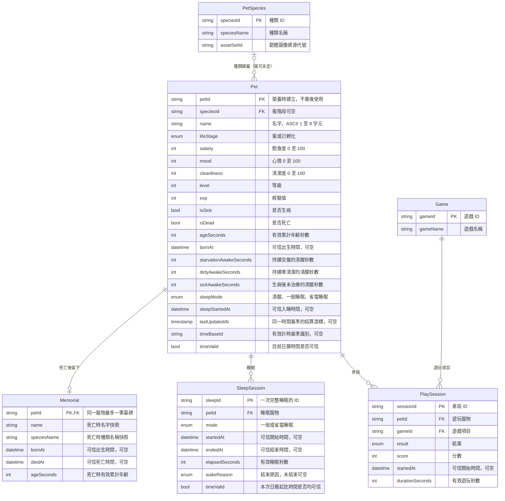

# 神秘蛋電子寵物：資料關聯圖（ERD）

依據 [專題企劃](project-plan.md) 第 4、6、8 節；日期：2026-09-24。這是建議的邏輯資料模型，尚未實作成資料庫。首版 ESP32 使用 Preferences／NVS 序列化存檔，不要求安裝 SQL 資料庫。

對應的 SQLite 建表語句見 [database-schema.sql](database-schema.sql)。

本圖選用企劃允許的「蛋與寵物共用同一筆資料」方案：領養即產生 petId，孵化前 speciesId 可空，孵化後固定種類。欄位型別為概念型別，實際儲存寬度與列舉值待存檔格式定稿。

## ERD

## 怎麼讀這張圖

- `PK`：主鍵，唯一識別一筆資料。`FK`：外鍵，對應另一個實體的主鍵。
- `||` 表示恰好一筆、`o|`／`|o` 表示零或一筆、`o{` 表示零到多筆。
- 一種寵物種類可對應多隻寵物；每隻寵物最多一種，蛋尚未孵化時可沒有種類。
- 一隻寵物可玩多種遊戲，一種遊戲也可由多隻寵物玩。PlaySession 將此多對多關係拆成兩個一對多關係，每筆代表一次遊玩。
- 一隻寵物可有多次睡眠；每筆睡眠只屬於一隻寵物。
- 一隻寵物最多一筆墓碑；每筆墓碑對應一隻死亡寵物。

## MVP 與後續擴充

- **首版必存**：當前寵物（含疾病計時、目前睡眠與最後結算游標）、墓碑群；種類與遊戲目錄可直接定義在韌體。
- **可後續擴充**：PlaySession 逐局歷史、SleepSession 完整睡眠歷史。MVP 可只保留遊戲摘要及當前睡眠快照，不必為深睡保存全部睡眠紀錄。
- 不設體力欄位；飽食、心情、清潔的文字等級由數值推導。玩家帳號、手機、雲端與感測器資料不在本次首版範圍。

## 實作時的重要約束

1. **邏輯關聯與 NVS 分開看**：本圖將 Pet 視為寵物生命週期的邏輯身分。在未來關聯式資料庫中，Memorial.petId 可作 FK，需保留對應 Pet 身分列；死亡後可移除／封存可變狀態。ESP32 首版不需要永久保存所有舊 Pet 完整快照，墓碑採獨立快照保存 petId、名字與種類顯示名，不能依賴已被新蛋取代的當前寵物物件。NVS 不執行 SQL 外鍵約束。
2. **墓碑保存**：死亡流程以 petId 去重，成功保存後才能領養新蛋；新蛋使用新 ID。墓碑內容唯讀，但允許玩家明確刪除。首版最多 32 筆，滿額不得自動覆寫，開始下一隻前須選擇刪除並二次確認。
3. **未知時間**：每個日曆時間欄位各自允許空值，空值顯示「時間未知」。例如出生未知但死亡時間可信時，仍保留死亡時間；不能只用一個布林旗標否定全部日期，也不能事後回填無證據的日期。
4. **疾病與睡眠**：空腹、零清潔分別保存連續清醒秒數，避免交替觸發被錯算成持續暴露。一般睡眠與 Deep Sleep 暫停疾病倒數；真正斷電且無有效時間基準時，不猜測離線時間。
5. **只結算一次**：lastUpdatedAt 必須搭配有效 timeBaseId 解讀，不能跨開機直接相減 millis()。Timer 量光仍屬同次睡眠，不應每次都結束 SleepSession。SleepSession 若保留，是歷史紀錄；目前狀態以 Pet 為準，結束時一致寫入。
6. **遊戲獎勵**：若實作可恢復的逐局結算，需以 sessionId 搭配獎勵套用狀態或原子快照，確保重啟不重複領取；本圖的結果欄位本身不保證交易一致性。
7. **存檔封套**：magic、schemaVersion、payloadLength、sequence、checksum 屬儲存格式，包住當前寵物與墓碑等完整快照，不是新的遊戲實體。依企劃使用 A／B 槽及有效性驗證；此圖不定義具體二進位格式。

本次僅新增 ERD 文件；沒有修改韌體或宣稱已完成資料保存。
