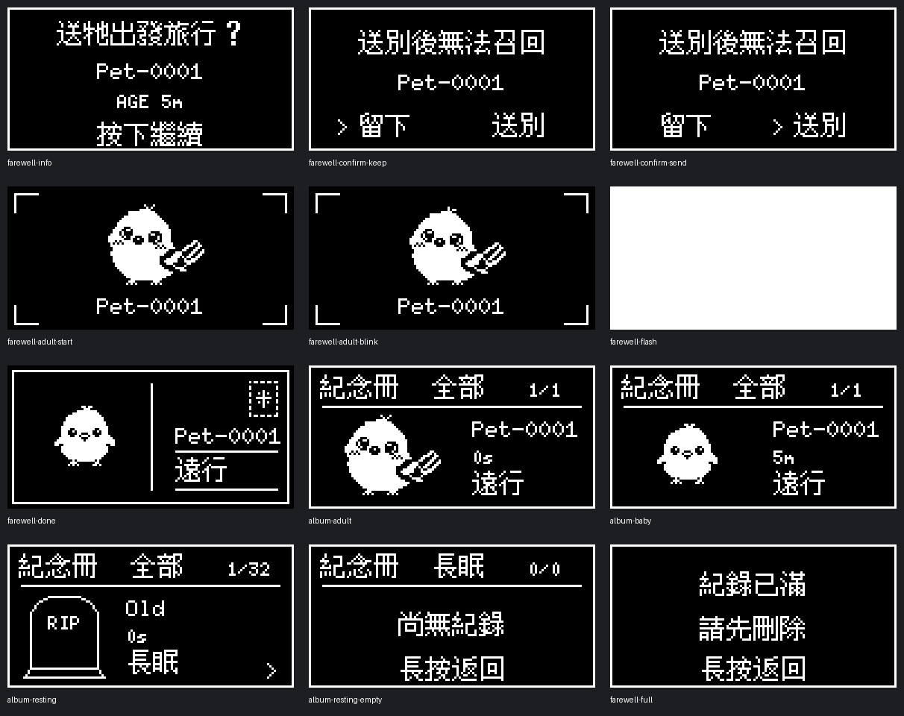
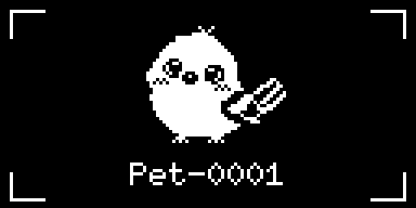
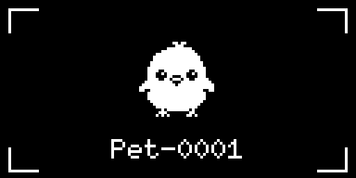
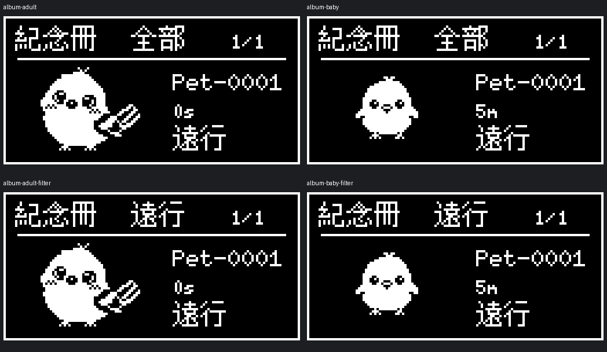

# 送別與紀念冊驗收

規則與唯一進度見 [主企劃 A6-FAREWELL](project-plan.md#progress)。目前版本 1.6.1；不新增自然死亡、死因或圖片素材。

## 操作

1. 清醒的幼鳥／成鳥：選單第三頁「送別」→名字／時間→不可召回確認。預設「留下」，右／下才選送別；長按可返回。健康、生病使用同一文案。
2. 保存成功後先顯示四角取景框，中央小鳥播放平常眨眼一輪（睜眼 1600ms／閉眼 1000ms），下方顯示名字；2600–2699ms 全畫面閃白，2700ms 切換定格明信片。全程消耗操作，完成瞬間的按鍵也不穿透。
3. 定格明信片等待玩家按下，再選查看紀念冊或領養新蛋；無逾時跳頁。重開機後已送別且保存完成，也直接顯示這張明信片。
4. 紀念冊：左右切換全部／遠行／長眠，上下翻頁；按下進入刪除確認（預設 No），長按返回。右下箭頭代表可進入刪除；當前已告別寵物的紀錄在領養前不允許刪除。
5. 蛋不能送別；睡眠先起床。容量 32 筆共用，送別前滿額先整理；第 33 筆只供死亡事件使用。沒有獎勵或召回功能。

## 定案明信片座標

2026-10-05 使用者採用第三版排版，實際成鳥 UI framebuffer 與 `farewell-postcard-128x64-v3.png` 逐像素相同。

- 外框 `(2,2)`，124×60；中線 `x=64, y=8..55`。
- 小鳥使用正常睜眼格，原尺寸64×44、x=3；按可見像素上下邊界計算垂直置中，幼鳥／成鳥皆適用。
- 名字 `(75,35)`（baseline），最多8字元；名字下橫線 `(75,38)..(120,38)`。
- 「遠行」baseline `(75,51)`；下橫線 `(75,55)..(120,55)`。
- 郵票外緣 `(108,7)..(120,22)`，齒孔及星形皆為程式繪製；右側保留內縮1px的定案座標。
- 拍照前取景框四角 `(3,3)/(124,3)/(3,61)/(124,61)`，小鳥 `(32,0)`，名字置中baseline57。白光後換成明信片，不使用移動離場。

## 保存與升級

- 寵物 schema V2：93-byte payload／109-byte record；V1 92／108 仍可讀取，departed 缺省 false。`PetSnapshotV1` 暫保留 C++ 型別名稱，磁碟版本由 SaveFormat 決定。
- 紀念冊 V2：每筆 28 bytes（原 26 bytes 加告別類型／成長階段），33 個位置，941-byte 完整紀錄。V1 875-byte 紀錄可讀，全部視為長眠、階段未知。不改名字或年齡。
- 送別前先保存現有紀念冊備份。成功保存已送別寵物即為不可撤回點；再保存紀念紀錄。中斷後按 petId 去重補寫，完成前不能領養。沒有可信日曆時只顯示有效年齡。
- 保存錯誤後可按下重試，已終止狀態每 10 秒自動重試；活著且尚未提交時可返回照顧。兩個槽都無有效資料時沿用保護策略，禁止覆蓋，不能把資料損毀當作空紀念冊。
- A／B 槽交替，CRC32 與序號驗證仍生效；RTC magic 更新為 `0x44535033`，舊 RTC 不直接套入新快照。
- 升級不需 erase flash。舊韌體不認識 V2，不能把降版視為支援的還原方法；請保留升級前備份作需要時的恢復來源。

## 自動驗證與預覽

在專案根目錄執行 `tools/test_rps.ps1`。新增 `test/farewell_native.cpp` 使用真實 Save 編碼／解碼及記憶體 Preferences 模型，覆蓋健康／生病、蛋／睡眠限制、終止後無成長／疾病／獎勵、V1 升級、混合版本槽、四個寫入階段失敗／部分寫入、重開機／去重、領養失敗及 32＋1 容量。這不是實機 NVS 或斷電測試。

UI 測試執行真實 UiController／PetIcons 與 OLED 字型，覆蓋雙步確認、取消、預設保留、幼鳥／成鳥／生病共用動畫、逐 100ms 取景／眨眼／全白／定格、2599／2600／2699／2700ms 邊界及輸入鎖、分類空頁、紀錄保護、刪除、滿額、開機恢復與死亡中斷。原生渲染輸出於 `.pio/rps-preview`。

使用有 Pillow 的 Python 執行 `tools/render_farewell_preview.py` 產生以下圖檔：

## 上板驗收

- 健康與生病的幼鳥／成鳥，確認兩次告別、取消、相同文案及拍照節奏；蛋按送別只提示失敗。
- 送別後重開機停在完成／待保存畫面，紀念冊只有一筆遠行。領養後新 ID／名字／蛋正常，舊紀錄保留。
- 於紀念冊備份、寵物告別檢查點、紀念紀錄及新蛋寫入附近斷電；檢查有效槽恢復、不重複、不丟紀錄。先用測試資料做斷電專項，勿擦除正式 NVS。
- 32 筆時不能送別；死亡可增至 33，刪除一筆舊紀錄後才能領養。取消刪除沒有資料變動。
- 回歸自然病死、一般睡眠／Deep Sleep 醒來與睡夢死亡；不可將遠行歸類為死亡。
- 更新後的 App 顯示「已遠行」，`is_dead=false`；新蛋恢復一般顯示。舊 App 需同步更新。Flutter／BLE 實機結果另記主台帳。

## 2026-10-06 上板回報與修正

使用者回報送別時重開機、紀念冊小鳥腳部被下框遮住。這不是新版實機驗收通過的回報。第三點「刪除重複遠行標示」已由使用者撤回，文字位置及內容維持原樣。

- 保存的序列化緩衝（941 bytes）與兩份紀念冊 scratch 改由 Save 固定持有；decoder 在私有 scratch 中驗證，公開紀念冊只在保存／載入成功後更新。沒有新增 heap allocation、沒有改 NVS 格式或加大主迴圈堆疊。
- 紀念冊可見圖案在內容區 y=19..60 置中，移動時只畫可見像素，避免透明 canvas 擋住邊框；回歸確認 y=61／62 的角色欄沒有像素。
- 刪除失敗不改當前紀念冊，成功後重開機保留刪除結果；既有送別故障注入、去重、升級及 UI 回歸通過。
- 啟動 Serial 會列印 `Reset reason`，便於重測仍發生重開機時診斷。

### 編譯器堆疊量測

使用原工具鏈及最佳化設定，另以 `.pio/stack-before.ini`／`.pio/stack-after.ini` 加入 `-fstack-usage` 建置，證據在 `.pio/stack-before/esp32dev/src` 及 `.pio/stack-after/esp32dev/src`。正式設定不加入這個診斷旗標。

| 函式 | 修正前 frame bytes | 修正後 frame bytes |
|---|---:|---:|
| finishFarewell | 1360 | 32 |
| saveMemorials | 2384 | 112 |
| readMemorialSlot（含 decoder） | 2400 | 144 |
| loadMemorials | 2704 | 48 |

主迴圈／beginFarewell／finishFarewell／appendMemorial／saveMemorials／readMemorialSlot 的對應 frame 合計約由 6560 降到 752 bytes。這是靜態呼叫路徑分析，不是實機 high-water mark；Arduino 主迴圈預設 8192 bytes，額外底層呼叫仍會用堆疊。重開機原因目前推測為堆疊不足，缺少 panic log，需上板重測佐證。
