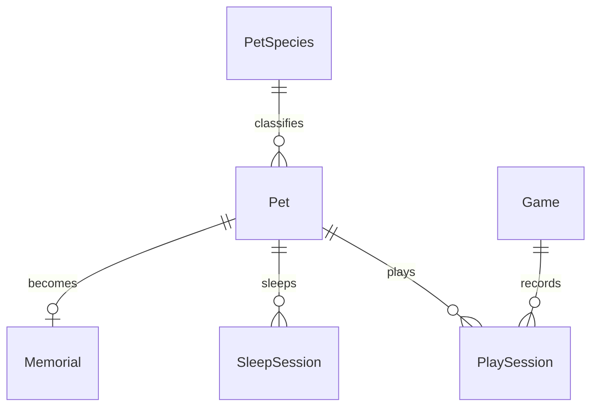

# 神秘蛋電子寵物：專題企劃與進度追蹤

> 一顆未知的蛋，會孵化成什麼樣的寵物？

- 更新日期：2026-09-25。
- 目前階段：**A3 寵物核心進行中（約一半；依團隊描述，不是量測完成率）**。
- 版本依據：目前工作目錄的實際程式，包含尚未提交的中文狀態頁與字圖變更；不是只看 Git 已提交版本。
- 本文件整合舊企劃、現有程式、資料庫草圖與新增睡眠需求。附件中的建議視為規劃素材，不代表已採用或已實作。
- `[x]` 表示程式中已有實作；`[ ]` 表示未完成或待驗收。**程式已有實作不等於本次已完成實機測試**。
- 標記「建議／待決定」的內容是本次補充方案；未出現在程式裡的舊功能，不直接推定為團隊已決議刪除。

## 1. 專案目標與範圍

以 ESP32 NodeMCU-32S 製作可離線、獨立運作的電子寵物。玩家從神秘蛋開始，透過餵食、遊戲、清潔與休息培養寵物；後續加入環境互動與手機擴充。正式名稱、角色造型與數值平衡尚待決定。

開發範圍：

- **A：核心電子寵物**。OLED、搖桿含按壓開關、蜂鳴器、養成、存檔及基本省電；不以網路或感測器為必要條件。
- **B：環境互動**。優先評估 BH1750 明暗與睡眠整合；溫濕度、MPU6050 維持後續候選，不視為已確認採購或必做項目。
- **第二階段：手機與連線**。Flutter、Bluetooth、圖鑑與歷史資料；Wi-Fi／MQTT／伺服器／AI 再後續評估。目前皆未實作。

預期核心循環：神秘蛋 → 互動孵化 → 隨機寵物 → 餵食／遊戲／清潔／休息 → 成長 → 保存並繼續養成。

## 2. 與舊版企劃的差異

- **操作改以搖桿整合**：目前只有方向與 SW 按壓操作，沒有獨立按鈕的 GPIO 或模組；獨立按鈕不列入目前必備硬體。
- **核心需求數值改變**：現有實作為飽食度、心情、清潔度；MVP 決定不加入體力。睡眠仍有用途，但不需要為此增加第四個需求值。
- **增加健康資料**：已有六小時疾病觸發、治療及生病後 24 小時清醒死亡門檻；死亡畫面、墓碑及重養流程仍未完成。疾病、治療、死亡與墓碑紀錄已確定為 MVP 必做。
- **畫面超出舊 A2 規劃**：已有狀態卡焦點、兩頁中文詳細狀態及自訂中文字圖；主畫面角色仍是史萊姆占位圖。
- **等級、經驗值只有資料**：沒有升級、成長階段或外觀演化邏輯；主畫面底線不是經驗條。
- **保存只是介面占位**：`Save::init()` 只設定初始化旗標，不能斷電續玩。
- **新增兩種睡眠**：一般睡眠供展示與養成；Deep Sleep 供省電，依賴保存、計時與喚醒後恢復。
- **新增資料關聯規劃**：將草圖的「遊玩」改為寵物與遊戲之間的紀錄，補上睡眠紀錄與存檔版本。
- 舊版「3～5 種寵物」「接食物＋猜拳」保留為候選目標，尚無程式或素材證明已完成，也不宣稱已被刪除。

## 3. 現況盤點與程式依據

### 3.1 硬體與開發基礎

- [x] PlatformIO／Arduino／C++，環境名稱 `esp32dev`，實際板型 `nodemcu-32s`，序列埠 115200。
- [x] 使用 U8g2，SH1106 128×64 I2C OLED，設定地址 `0x3C`。
- [x] 顯示模組封裝文字、字圖、框線、畫面更新與 I2C 掃描。
- [x] 搖桿開機中心校正、方向死區、方向鎖定／連發、按鍵去彈跳、短按與長按。
- [x] 無源蜂鳴器非阻塞音序；確認、取消、成功、失敗、孵化音效函式已存在。
- [ ] 本版本所有輸入、OLED 與音效的實機回歸紀錄。音效函式存在不等於對應遊戲已存在。

依據：[硬體設定](../include/HardwareConfig.h)、[專案設定](../platformio.ini)、[輸入](../src/hardware/Input.cpp)、[顯示](../src/hardware/Display.cpp)、[音效](../src/hardware/Sound.cpp)。

### 3.2 UI 與操作

- [x] 開機畫面約 1.5 秒後切換主畫面。
- [x] 主畫面：心情、飢餓圖示、寵物占位圖、病情／清潔警示與等級。
- [x] 主畫面向右選狀態卡、向左取消；選中後短按進詳細狀態，未選中時短按進主選單。
- [x] 中文詳細狀態：第 1 頁為飽食／心情／清潔，第 2 頁為等級／健康；右或下翻次頁、左或上回前頁，長按回主畫面。
- [x] 主選單含 Feed／Clean／Treat／Play／Rest／Status，上下循環選取、短按確認、長按返回。
- [x] 主選單 Status 與主畫面狀態卡進入同一個詳細狀態頁；Feed／Clean／Treat 已有操作頁，Play／Rest 仍為 `Not implemented`。新操作頁尚未實機驗收。
- [x] 可見寵物數值變動時以版本號讓主畫面與詳細狀態重繪；實機更新效果仍待驗收。

依據：[UI 控制器](../src/ui/UiController.cpp)、[角色與圖示](../src/ui/PetIcons.cpp)、[狀態頁精簡字型](../include/ui/StatusFont12.h)。

### 3.3 寵物資料

目前 `PetData` 擁有：

- `satiety`：飽食度，初始 80，限制 0～100；數字越高越飽。
- `mood`：心情，初始 80，限制 0～100。
- `cleanliness`：清潔度，初始 100，限制 0～100。
- `level`：初始 1，型別 `uint8_t`；目前 setter 未限制最低等級為 1。
- `exp`：初始 0，型別 `uint16_t`；尚無升級或溢位處理規則。
- `isSick`、`isDead`：初始 false；疾病可由需求持續為 0 觸發，生病後累計 24 小時清醒時間會自動死亡。
- `dangerSeconds` 與 `sickAwakeSeconds`：記錄連續危險暴露與生病後清醒時間；死亡時停止在 24 小時門檻，不把同批次超出的時間算入年齡或需求衰減。
- `ageSeconds`：開機後累計清醒秒數；尚未保存，睡眠與重啟後也尚未補算。
- 清醒衰減間隔：飽食 600 秒、清潔 900 秒、心情 1200 秒各降 1 點；保留未滿一輪的秒數。這是首版測試參數。

已實作的衍生狀態區間：

- 飽食：76～100 飽足、51～75 稍餓、26～50 飢餓、11～25 很餓、0～10 極餓。
- 心情：81～100 非常開心、61～80 開心、41～60 普通、21～40 難過、0～20 非常難過。
- 清潔：76～100 乾淨、51～75 稍髒、26～50 髒、0～25 非常髒。

尚未有寵物 ID、名字、種類、可跨重啟保存的年齡、蛋／孵化階段、睡眠狀態或時間戳。需要新增的欄位應在相應階段再落實；體力不列入 MVP。

依據：[PetData 宣告](../src/pet/PetData.h)、[初始值與區間](../src/pet/PetData.cpp)。

### 3.4 實際尚未完成的玩法

- [x] 清醒時間流逝造成三項需求衰減；一般睡眠與斷電補算尚未實作。
- [ ] 餵食、清潔與一般睡眠。（餵食與清潔已可操作；一般睡眠未做。）
- [ ] 蛋、互動、孵化動畫與隨機種類。
- [ ] 迷你遊戲、獎勵、經驗累積、升級、成長階段。
- [ ] 疾病、治療、死亡、墓碑群與重養流程。（六小時疾病觸發、治療與 24 小時清醒死亡門檻已做；死亡畫面、墓碑及重養未做。）
- [ ] NVS 保存／載入、Deep Sleep、喚醒與離線時間結算。
- [ ] 感測器、電池管理、手機與連線。

主程式目前更新清醒時間、輸入、UI 與音效；每次開機仍建立預設寵物。[Save](../src/storage/Save.cpp) 尚無讀寫。[README](../README.md) 已更新為接手入口；[架構筆記](architecture.md) 的「狀態卡僅裝飾」等描述仍落後於工作目錄，實作前以程式與本企劃交叉核對。

## 4. 功能規劃與待定規則

### 4.1 A3 的下一步

優先完成資料與畫面的閉環，再加入大量玩法：

1. 實機驗收 Status 選單與主畫面狀態卡共用的詳細頁及長按返回操作。
2. 已建立清醒時可測試的秒數更新與需求衰減；睡醒結算須在一般睡眠規則確定後接入，保留同一套狀態計算。
3. 清潔操作、疾病觸發、治療及死亡門檻已接上；接著完成死亡畫面、墓碑與重養流程，並使疾病進度可保存。
4. 已加入可見數值版本追蹤，讓主畫面與詳細狀態在寵物狀態變動時重繪；仍需實機驗收。
5. 年齡以累計有效秒數記錄；升級上限與經驗門檻由實作 Agent 選定、測試並記錄，再固定存檔格式。

### 4.2 養成、孵化與遊戲

- 餵食增加飽食度，可選擇影響心情；舊版 `+20／+5` 僅為範例，不是已確認規則。
- 清潔提高現有清潔度；需新增可到達的操作入口，不能只有清潔警告圖示。
- 一般睡眠提供睡覺／起床動畫，可適度恢復心情，並暫停「清醒且未照顧」造成的疾病倒數；不增加體力數值。
- 孵化需保存「尚未孵化／已孵化」及選定種類，防止每次重開機重新抽寵物。
- 建議先完成 1 個正式角色與孵化流程，再擴增至原定 3～5 種；正式種類與機率待美術／玩法討論。
- 迷你遊戲候選為接食物、猜拳。先完成 1 種，再以 2 種作為原企劃 A 階段目標；每種都需有開始、操作、結束、退出與一次性結算。
- 升級依經驗門檻決定；若成長階段只由等級推導，僅保留一份規則，避免存成互相矛盾的兩份資料。

### 4.3 疾病、治療、死亡與重養（MVP 必做）

以下是交給實作 Agent 的**首版預設規則**，數值應集中設定，實機試玩後可調整，不要求人類先決定每個門檻：

1. 清醒時飽食度持續為 0，或清潔度持續為 0，累計 6 小時後生病；離開危險區間即清除尚未生病的連續計時。治療前畫面要明顯提示病情。
2. 增加「治療」操作，不消耗尚未定義的道具；治療使 `isSick=false` 並清除疾病倒數，但仍需餵食／清潔才能避免再次生病。先做可玩的明確規則，之後再評估道具系統。
3. 生病後累計 24 小時**清醒時間**而未治療才死亡；一般睡眠與 Deep Sleep 暫停疾病倒數，避免睡一晚意外死亡。死亡前要有持續可見的警告，不能只在一次音效裡提示。
4. 死亡是終止狀態：立刻停止餵食、遊戲、治療與時間結算。原寵物資料轉成唯讀墓碑紀錄，含 `petId`、名字、種類、出生時間、死亡時間及年齡；同一死亡事件只能新增一次墓碑。
5. 顯示死亡／墓碑畫面，提供「查看墓碑群」與「領養新蛋」。領養新蛋產生新 `petId`，保留舊墓碑；主畫面顯示新蛋，不把已死亡寵物重設成活著。
6. 主選單增設「遊玩紀錄」入口，其中先提供「墳墓群」可翻看過去墓碑；逐局遊戲歷史可後做。MVP 先保留最多 32 筆；滿額時仍保存當前死亡墓碑，但需在開始下一隻之前提示使用者選擇一筆刪除並二次確認，不自動覆寫舊紀錄。後續若要永久累積，再設計匯出或外部儲存。
7. 開始養第一隻前提供搖桿輸入名字與日期時間的簡單設定；名字可限制為 OLED 現有字型可顯示的 ASCII 1～8 字元，提供預設名 `Pet-0001` 等。時間不可信時不偽造年月日：墓碑該欄顯示「時間未知」，仍保留可計算的年齡；重新設定時鐘不追填沒有證據的舊時間。

疾病進度與墓碑群屬存檔資料。改版前應以「生病 → 治療 → 復發 → 死亡 → 看墓碑 → 領養新蛋 → 斷電續玩」做完整驗收；斷電或睡醒後不得重複新增墓碑。兩個門檻採累計清醒時間，不以 `millis()` 跨重啟相減。

## 5. 硬體與接線規劃

以下 GPIO 為目前程式設定，實際模組供電與接腳標示仍須核對：

- OLED：SDA → GPIO21、SCL → GPIO22，共地，I2C 地址 `0x3C`。使用符合模組規格且 I2C 訊號為 3.3V 的供電／上拉配置。
- 搖桿：VRX → GPIO34、VRY → GPIO35、SW → GPIO26；以 3.3V 供應電位器，避免類比輸出超過 ESP32 輸入範圍。SW 按下接地，未按為高。
- 蜂鳴器：控制訊號 → GPIO27；目前軟體按無源蜂鳴器設計。驅動方式須依實際蜂鳴器電流確認，必要時加電晶體，不能把未知負載直接當 GPIO 可供電元件。
- 文件中硬體代號有差異：程式註解寫 HW-504，需求寫 B103348；先核對實物是否為 VRX／VRY／SW 五腳搖桿，不直接視為完全相同型號。
- 類比輸入 GPIO34／35 保留給方向控制；睡眠喚醒使用 SW，不依賴持續讀取類比搖桿。

### 5.1 SW 喚醒接線

建議 SW／GPIO26 對 3.3V 加約 10kΩ 外接上拉、按鍵對 GND，並核對模組是否已內建上拉。上拉接常供電端；若未來關掉搖桿電位器電源，SW 仍必須可用。

GPIO26 是經典 ESP32 的 RTC GPIO，可採 `esp_sleep_enable_ext0_wakeup(GPIO_NUM_26, 0)` 設定低電位喚醒。一般執行時的 `INPUT_PULLUP` 不應被當成睡眠期間偏壓的唯一保證；若採內部上拉，依 RTC GPIO API 明確設定。醒來先 `rtc_gpio_deinit(GPIO_NUM_26)`，再恢復一般輸入初始化。此方案針對 NodeMCU-32S 的經典 ESP32，不套用 S2／S3／C3 的腳位表。[ESP32 睡眠模式文件](https://docs.espressif.com/projects/esp-idf/en/stable/esp32/api-reference/system/sleep_modes.html)

## 6. 一般睡眠與 Deep Sleep

### 6.1 一般睡眠：展示與遊戲狀態

- ESP32 及主迴圈保持運作，OLED 顯示像素 `Zzz`／睡覺動畫；不要假設 OLED 字型支援 Unicode emoji。
- 可讀取搖桿、播放必要提示並更新寵物；依規則保留部分功能。
- 建議 Rest 入口提供一般睡眠及省電睡眠的選擇，避免使用者把關屏誤認為當機。
- 展示模式可停用自動 Deep Sleep；省電模式可在閒置達門檻後轉入 Deep Sleep。門檻、夜間時段和允許喚醒的操作待決定。
- 一般睡眠目前也是未實作，不等同已存在的 Rest 占位頁。

### 6.2 Deep Sleep：省電狀態

- OLED 進入關屏／省電狀態，蜂鳴器停止輸出，ESP32 不執行一般主迴圈。
- 不持續播放動畫、音效、讀取 VRX／VRY 或透過一般 I2C 程式輪詢感測器。
- SW 或 Timer 喚醒後重新走啟動／初始化流程，不從睡眠函式後面繼續原本 UI。
- 先完成手動睡眠與相對時間定時喚醒，再加入閒置自動睡眠；沒有可信時鐘前不承諾「每天晚上固定時間」自動入睡。

### 6.3 進入與恢復流程（待實作）

1. 確認不在遊戲結算、孵化結果寫入等中途；先把當前寵物更新至現在。
2. 等待 SW 放開並穩定後才入睡。EXT0 是電位觸發，若仍按住會立刻醒來；等待期間仍允許取消，不使用無限阻塞等待。
3. 記錄睡眠開始時間、最後結算時間、保存版本與完整寵物狀態；檢查寫入結果，失敗則顯示錯誤並取消入睡。
4. 停止音序並確保蜂鳴器睡眠時不會浮接鳴叫；由 Display 封裝新增 OLED 省電介面，僅清空畫面不等於關屏。
5. 配置 RTC 記憶體、SW 與 Timer 喚醒來源，檢查 API 回傳值，最後呼叫 `esp_deep_sleep_start()`。
6. 開機最前端辨識 `esp_sleep_get_wakeup_cause()` 與重置原因；選擇有效 RTC 快照或 NVS 存檔，而非先建立新寵物覆蓋。
7. 計算實際經過時間，套用一次狀態更新，推進最後結算時間；再次睡眠不得重複累算同一時段。
8. 恢復一般 GPIO、I2C、OLED、音效與輸入。把此次喚醒按壓消耗掉，放開後才接受新的操作。
9. 目前 `Input::init()` 每次量測搖桿中心；若醒來時仍偏移，會誤校正。實作時需保存有效校正值或要求回中後才重校正，不能原封不動沿用每次開機校正。
10. 使用者真正起床時顯示起床動畫並回主畫面；B 階段定時量光而繼續睡眠時，不必每次點亮 OLED 或播放音效。

### 6.4 Timer 與時間基準

Timer 以相對時間設定，例如 `esp_sleep_enable_timer_wakeup(60ULL * 1000000ULL)` 為 60 秒測試；SW 與 Timer 可同時啟用，先發生者喚醒。API 與 RTC 保留行為需以專案實際安裝的 Arduino／ESP-IDF 版本編譯及上板確認，不能因官方最新文件有某 API 就假設本機版本相同。[ESP32 睡眠模式文件](https://docs.espressif.com/projects/esp-idf/en/stable/esp32/api-reference/system/sleep_modes.html)

**不要跨 Deep Sleep 以 `millis()` 差值計算睡眠，也不要把設定的 Timer 時長當作實際睡眠時間**，因為 SW 可能提早喚醒。

建議睡前／醒後透過 RTC 支援的系統時間（如 `gettimeofday()`）取差值，保留同一時間基準；醒來不要任意重新設定時間。RTC 系統計時可跨 Deep Sleep，但斷電後無法靠它知道經過多久，且內部時鐘可能漂移。[ESP32 系統時間文件](https://docs.espressif.com/projects/esp-idf/en/stable/esp32/api-reference/system/system_time.html)

- 無網路首版：支援「睡 60 秒／睡指定時長」，以實測驗證時間差；年齡以累計有效秒數計算。
- 若要「22:30 睡、07:00 醒」，先要有可信日期／時間，例如手動設定且持續供電，或未來加具備備援電源的外部 RTC；網路校時僅是後續可選項。
- 真正斷電且無可信時鐘：讀回最後存檔，**不猜測離線時長**；建議暫停該未知時段的衰減／恢復，提示時間需重設。
- 睡眠結算建議：`elapsed = max(0, now - lastUpdatedAt)`；設定合理的補算上限與餘數累積方式，避免過長離線導致暴增或短週期四捨五入損失。恢復速率、飢餓衰減、年齡是否含睡眠都須形成明確規則。
- 8.5 小時等於 30,600 秒，只能在時間基準有效時依此結算；睡眠可更新年齡與心情，但暫停疾病倒數，不因睡眠直接死亡。

### 6.5 保存策略

`Preferences` 是 Arduino 封裝，NVS 是其使用的非揮發性儲存機制，資料存於 Flash；它們不是三個互不相關的保存選項。[Preferences 官方文件](https://docs.espressif.com/projects/arduino-esp32/en/latest/api/preferences.html)

- **RTC Memory**：使用 `RTC_DATA_ATTR` 保存小型快照、睡眠時間與結算資訊，供 Deep Sleep 快速恢復；不能作為斷電保存的唯一依據。
- **Preferences／NVS**：保存可斷電恢復的寵物檢查點。首版建議手動入睡前、孵化完成及重要里程碑寫入，平常合併變更後限頻保存，不每幀／每秒寫 Flash。
- B 階段頻繁定時量光再睡時，以 RTC 更新為主，NVS 按既定檢查點保存，文件與 UI 應說明突然斷電最多可能損失多少近期進度。
- 存檔包含 magic、`schemaVersion`、長度、序號與校驗資訊；使用明確欄位序列化，不直接保存含指標的物件或依賴 C++ 結構 padding。
- 建議用完整快照搭配 A／B 槽與有效性檢查，寫入新槽確認成功後才採用；避免多個 key 寫到一半形成混合版本。
- 載入順序：有效且符合此次 Deep Sleep／版本的 RTC 快照 → 最新有效 NVS 快照 → 無存檔時才建立新寵物。損毀或不支援版本應提示，不能靜默覆蓋唯一舊存檔。
- 新增寵物身分、疾病計時與墓碑等欄位時，定義舊版本遷移與預設值；存檔錯誤、NVS 空間不足及斷電中斷寫入納入驗收。墓碑寫入成功後才能提供「領養新蛋」。

### 6.6 電池與整機耗電

Deep Sleep 是本次新增的軟體目標，**尚不能據此承諾續航天數**。NodeMCU-32S 板上的電源指示燈、USB 轉序列晶片、穩壓器，以及 OLED 模組、搖桿電位器和蜂鳴器驅動都可能持續耗電；晶片睡眠電流不等於整台裝置電流。

- [ ] 確認電池種類／容量、充電保護與供電轉換方案，再依實際板卡規格確認供電入口；不直接把未穩壓電池當作 3.3V 電源。
- [ ] 分別量測正常操作、一般睡眠、Deep Sleep、定時喚醒期間的整機電流，記錄電壓與 USB 是否連接。
- [ ] 以實測平均電流、可用容量與轉換損耗估算續航。
- [ ] 若 Deep Sleep 仍耗電高，再評估切斷 OLED／搖桿電位器電源、低靜態電流穩壓器或其他板卡；不在第一版直接修改未知開發板電路。
- [ ] 外設斷電時檢查 I2C／GPIO 是否反向供電，並維持 SW 喚醒電路常供電。

## 7. BH1750 與環境互動（B 階段）

BH1750FVI 的標準接腳沒有明暗門檻 INT／警報輸出，不能直接規劃成「BH1750 發中斷喚醒 ESP32」。若要硬體即時明暗喚醒，需另選帶中斷的感測器或增加比較器等電路，屬於另一個硬體方案。[ROHM BH1750FVI 原廠資料表，由 WEMOS 提供副本](https://www.wemos.cc/en/latest/_static/files/bh1750fvi-tr.pdf)

第一版採定時輪詢：

1. BH1750 與 OLED 共用 SDA21／SCL22；核對模組供電、3.3V 上拉與地址，BH1750 常用 `0x23` 或 `0x5C`，不同於 OLED `0x3C`。
2. Timer 喚醒 → 初始化必要硬體 → 發出量測命令並等候量測完成 → 讀取照度。
3. 仍暗：更新時間結算，讓感測器進入低耗電模式，再次 Deep Sleep。
4. 夠亮：恢復使用者操作、OLED 與起床動畫；SW 喚醒則優先尊重玩家操作，不因房間暗就立即睡回去。
5. 建議先試每 5～15 分鐘量一次，作為待調參數；不是全天連續 I2C 讀取，也不是已確認規格。
6. 使用不同入睡／起床照度門檻及連續確認次數，避免陰影、開燈造成反覆切換。
7. 感測器遺失或讀取失敗應保留手動／Timer 模式，不永久卡住或禁止玩家喚醒。

溫濕度與 MPU6050 後續先確認可帶來的互動，再決定是否實作。不要在主 CPU 深睡時假設一般感測迴圈仍運作。

## 8. 資料模型：由草圖整理為可實作版本

這是**邏輯模型提案**，目前 ESP32 沒有 SQL 資料庫，也不需為了 ER 圖導入資料庫伺服器。A 階段可用 C++ 資料結構、固定資源目錄與 NVS 快照；完整歷史紀錄留給後續有需求的儲存／App。

### 8.1 草圖的關係修正

- 「寵物種類 1 → N 寵物」成立：同一種類可有多隻寵物；MVP 裝置先只有一隻當前寵物。
- 「遊玩」應連接**寵物與遊戲**，不接在「心情值」屬性上；心情變動是結果，不是關係主體。
- 同一寵物可多次玩同一遊戲，因此抽成有獨立 ID 的 `PlaySession`，不能只拿 `petId + gameId` 當唯一紀錄鍵。
- 「成長階段」若由等級推導，可保留為衍生屬性；若未來依照顧歷史分支進化，則要另存分支狀態。
- 「圖像編號」若只指一張靜態預設圖可放種類；若含不同階段、表情、動畫幀，建議改為資源集合或獨立 Asset 定義。



蛋尚未孵化時可先作獨立生命週期資料，孵化後才建立具種類的 Pet；若選擇蛋與寵物共用同一筆資料，則孵化前 `speciesId` 可空，需同步調整上圖關係。

### 8.2 建議實體與欄位

**PetSpecies：靜態種類目錄，尚未實作。**

- `speciesId` 主鍵、`speciesName`、`assetSetId`；機率及可用種類待定。
- 圖像資料先放韌體資源，不把整張 bitmap 重複寫入每隻寵物的 NVS。

**Pet：當前寵物快照。**

- 現有欄位：`satiety`、`mood`、`cleanliness`、`level`、`exp`、`isSick`、`isDead`。
- 擬新增識別：`petId` 主鍵、`name`、`speciesId` 外鍵、`lifeStage`（蛋／已孵化等；實際 enum 待定）。
- 擬新增 `ageSeconds`、`bornAt`、`sleepMode`、`sleepStartedAt`、`lastUpdatedAt`、`timeValid` 或時間基準識別，以及疾病連續暴露時間與生病後清醒時間。MVP 不設 `energy`。
- `schemaVersion` 等屬於存檔封套，不必塞進遊戲領域物件。
- 飢餓／心情／清潔分級從數值推導，不重複保存；死亡後不得再切回存活狀態，並需對應墓碑紀錄。

**Game：靜態遊戲目錄，尚未實作。**

- `gameId` 主鍵、`gameName`；必要時增加規則版本，供未來比較分數。

**PlaySession：一次遊玩結果，尚未實作。**

- `sessionId` 主鍵、`petId` 與 `gameId` 外鍵、`result`、`score`。
- 拆清楚 `startedAt`（有有效時鐘才填）與 `durationSeconds`，不要讓「遊玩時間」混用開始時刻和耗時。
- 可選擇保存獎勵／心情／經驗變化，並確保重開機不重複領取。
- MVP 建議只存次數與最高分等摘要；若要逐局歷史，先訂筆數上限／循環覆寫策略。

**SleepSession：睡眠處理資料，尚未實作。**

- `sleepId`、`petId`、`mode`、`startedAt`、`endedAt`、`elapsedSeconds`、`wakeReason`、`timeValid`。
- MVP 僅需目前睡眠快照與最後結算時間，完整歷史並非 Deep Sleep 的先決條件。
- Timer 量光只是同一次睡眠中的檢查；以最後結算時間避免重複更新心情／年齡，不把每次檢查都當玩家起床。

**Memorial：死亡寵物的唯讀墓碑紀錄，MVP 必做、目前未實作。**

- `petId` 為唯一鍵；保留 `name`、`speciesId`／種類顯示名、`bornAt`、`diedAt`、`ageSeconds`、`timeValid`。可加死亡原因，先以明確且不造成誤解的原因碼記錄。
- 出生／死亡時間包含日期與時刻；只有時鐘可信才存實際時間，否則顯示「時間未知」。年齡以有效累計時間顯示。
- 存檔需保證同一 `petId` 最多一筆墓碑、死亡事件不重入；墓碑群滿額時由玩家明確刪除才能繼續領養。

## 9. 軟體分工與擴充位置

目前：

- `src/main.cpp`：Application 擁有唯一 PetData，協調輸入、UI、音效與保存物件。
- `src/hardware/`：硬體介面；UI 不直接讀 GPIO 或操作 U8g2。
- `src/ui/`、`include/ui/`：畫面狀態、圖示與中文字圖。
- `src/pet/`：寵物資料、界限與衍生狀態。
- `src/storage/`：保存邊界，目前只有占位實作。
- `include/HardwareConfig.h`：GPIO 與硬體參數的集中來源。

後續建議新增寵物行為／時間更新、遊戲、電源／睡眠管理及時間服務模組，名稱於實作時決定。資料變更由應用／領域邏輯負責，UI 只送出意圖與顯示結果；保存負責序列化，睡眠管理負責協調入睡與恢復。正常互動維持非阻塞更新，不以長時間 `delay()` 實作睡覺。

## 10. 里程碑與驗收清單

保留 A1～A7 的原編號，新增 A6-S；V1～V4 是睡眠需求的功能組合，不是另一套競爭排程。

### A1：硬體基礎 — 程式已具備，待實機回歸

- [x] OLED、搖桿及音效模組與集中 GPIO 設定。
- [ ] 核對實際搖桿／蜂鳴器型號與接線，記錄方向、短長按、顯示與音效測試。

### A2：OLED UI — 基礎已具備，細節收尾

- [x] 開機、主畫面、主選單與中文詳細狀態。
- [x] Status 選單接通詳細頁，程式路由使用長按返回主畫面；實機返回操作仍待驗收。
- [ ] 實機確認中文、數值邊界、焦點與畫面不裁切。

### A3：寵物核心 — 進行中，當前重點

- [x] 三項需求、等級、經驗、生病／死亡旗標與衍生狀態。
- [x] UI 讀取同一隻寵物。
- [x] 清醒時以整秒更新三項需求；主畫面／詳細狀態在可見數值變化後重繪，衰減間隔集中於 `PetData`。
- [ ] 加入年齡、名字、唯一寵物 ID、疾病進度；體力不加入 MVP。（已加入暫存的累計清醒秒數，保存及睡眠年齡仍未完成。）
- [ ] 疾病、治療、死亡門檻及等級／經驗邊界集中設定並驗收。（六小時疾病門檻、疾病累計、治療與 24 小時清醒死亡門檻已有原生測試並通過韌體編譯，尚待實機驗收；等級／經驗規則未做。）
- [x] 原生單元測試涵蓋 0／100 限制、狀態交界、加減溢位、分段計時與 `millis()` 回捲；實機顯示驗收仍待完成。

### A4：蛋與孵化 — 未開始

- [ ] 蛋狀態、互動、晃動／裂開／出生、種類與資源目錄。
- [ ] 隨機結果一經決定即可保存，重開機不重抽。

### A5：養成與遊戲 — 未開始

- [ ] 餵食、清潔、一般睡眠、成長。（餵食 +20、清潔 +30 的首版入口已完成，尚未實機驗收。）
- [ ] 第一種迷你遊戲完整流程；第二種達成原企劃目標。
- [ ] 獎勵、音效與 UI 狀態一致，退出不重複結算。
- [ ] 一般睡眠可顯示動畫、喚醒並依規則更新心情與年齡。
- [ ] 治療入口、持續疾病警示、死亡畫面、墓碑群瀏覽與新蛋流程。（治療入口、既有病情圖示／狀態頁及核心死亡門檻已接上，其餘未完成。）

### A6：資料保存 — 只有占位介面

- [ ] 固定版本化格式、Preferences／NVS 保存及載入。
- [ ] 首次開機、正常重啟、真正斷電均走正確流程。
- [ ] 測試損毀、寫入失敗、寫入中斷電與舊版本遷移。
- [ ] 明確記錄自動保存頻率與可能遺失的最近進度範圍。
- [ ] 保存名字、出生／死亡時間有效性、疾病進度及墓碑群；死亡寫入與領養新蛋不重複、不丟舊紀錄。
- [ ] 墓碑群滿額時提示選擇並二次確認刪除；不得自動覆寫。

### A6-S：Deep Sleep — 新增、未開始

- [ ] 先以 60 秒 Timer 測試睡眠／恢復，再測 SW 提早喚醒及兩者同時啟用。
- [ ] 入睡後 OLED 關屏、蜂鳴器靜音；醒來硬體正常、按鍵事件不誤觸。
- [ ] SW 按住不造成入睡／醒來循環，搖桿偏移不污染中心校正。
- [ ] 比對睡前與睡後寵物、實際睡眠時長、心情、年齡與疾病倒數；同一時段僅結算一次。
- [ ] 真正斷電不把不可信時間當作有效睡眠。
- [ ] 多次入睡／喚醒及一晚長睡測試，記錄 RTC 漂移與整機耗電。

### A7：離線整合驗收 — 未開始

- [ ] 無手機、無網路、無環境感測器即可完成孵化與完整養成循環。
- [ ] 無手機、無網路可完成疾病、治療、死亡、墓碑群與新蛋循環；墓碑日期只在時間可信時顯示。
- [ ] 兩種遊戲、保存續玩、一般睡眠與深睡皆可示範。
- [ ] 長時間運作不鎖死、不重複結算，輸入、音效與畫面一致。

### B 與第二階段 — 未開始／保留

- [ ] B1：BH1750 明暗、遲滯與定時喚醒，讀取失敗仍可手動操作。
- [ ] B2：評估溫濕度功能及硬體，確認才實作。
- [ ] B3：評估 MPU6050 互動及硬體，確認才實作。
- [ ] B4：感測器整合回歸與耗電測試，不破壞 A 階段。
- [ ] 第二階段：確認 Flutter／Bluetooth 與資料同步需求後另開規格。

建議執行順序：**A3 收尾 → A4／A5 核心玩法（V1，含疾病、治療、死亡與墓碑）→ 一般睡眠（V2）→ A6 保存 → A6-S 深睡（V3）→ A7 → B1 明暗睡眠（V4）**。A4 可先做動畫，但在 A6 完成前不得勾選斷電不重抽或墓碑永久保存的驗收。

## 11. 待團隊決定與追蹤方式

### 已確認的產品決定

- 本專案主要由 Agent 撰寫程式與補齊可測試的細節；人類提供想法、硬體資訊與實機測試回報。Agent 遇到影響硬體採購、使用者資料或體驗方向的大決策才請人類決定。
- MVP 不加入體力。一般睡眠與 Deep Sleep 使用心情、年齡與疾病計時形成效果；若未來遊戲明確需要體力，再以新功能提案加入。
- MVP 包含疾病、治療、死亡、墓碑群及新蛋重養；第 4.3 節為首版預設規則。
- README 是跨開發者／Agent 的接手入口，需保持環境、語言、框架、依賴、程式結構、真實進度及實機驗收狀態與程式一致。

### 仍待決定或可由 Agent 做首版實作的細節

- [ ] 正式寵物種類、美術數量、遊戲清單及成長門檻。
- [ ] 自動睡眠閒置門檻、展示模式、心情更新率、補算上限；由 Agent 先選可測試預設值並記錄。
- [ ] 若團隊需要斷電期間準確計時，另評估有備援電源的外部 RTC；目前使用手動設定時間、有效性標記與「時間未知」顯示。
- [ ] 實際電池、供電模組與續航目標；先量測再承諾。
- [ ] 除墓碑群必存外，是否需要完整逐局遊玩／睡眠歷史；首版可先保存摘要。

每次完成工作後更新本文件相應核取項，附測試日期與證據；變更規則時新增一筆決策記錄。建議採用以下格式：

```text
日期：
階段／項目：
狀態：未開始／進行中／程式完成／實機驗收完成
負責人：
變更與決策：
驗證方式與結果：
程式提交／文件連結：
下一步或阻礙：
```

### 修訂紀錄

- **2026-09-25**：A3 核心加入生病後累計 24 小時清醒時間死亡；同批次超出死亡時刻的時間不再推進年齡或需求，死亡狀態不可由既有 setter 切回存活／健康。新增門檻前一秒、剛好死亡、跨疾病與死亡的大跨度更新及不可逆測試，原生測試執行通過。ESP32 韌體以 Espressif32 7.1.3、Arduino-ESP32 4.20017.260907、U8g2 2.36.18 編譯通過；死亡畫面與實機驗收仍未完成。
- **2026-09-24**：使用者回報 A3 首個增量已上板驗收：數值正常下降。接著加入 Feed／Clean／Treat 操作頁，飽食 +20、清潔 +30；清醒時飽食或清潔持續為 0 達 6 小時會生病，治療清除病情與計時，若需求仍為 0 可再次生病。原生門檻測試與韌體編譯通過；新操作頁及疾病顯示尚未上板驗收。死亡／墓碑／保存仍未做。
- **2026-09-24**：A3 首個程式增量：清醒時每 10 分鐘飽食 -1、每 15 分鐘清潔 -1、每 20 分鐘心情 -1；年齡累計清醒秒數，死亡後停止更新。以上為可調整的首版預設值。新增畫面版本追蹤，使可見數值變動時主畫面及詳細狀態自動重繪。原生測試通過，ESP32 韌體編譯通過；尚未上板驗收，未加入餵食、清潔、疾病觸發、保存或睡眠結算。
- **2026-09-24**：確認 Agent 主導程式實作與交接文件；MVP 不加體力，加入疾病、治療、死亡、墓碑群與新蛋重養；制定首版規則與時間可信性處理，同步更新 README。
- **2026-09-24**：依工作目錄建立新版企劃；標明 A3 現況、清潔與健康資料、中文狀態頁、尚未串接功能；補上一般睡眠、Deep Sleep、SW／Timer、保存／時間基準、BH1750 限制及資料模型。此次僅更新文件，未變更韌體或執行實機驗收。

