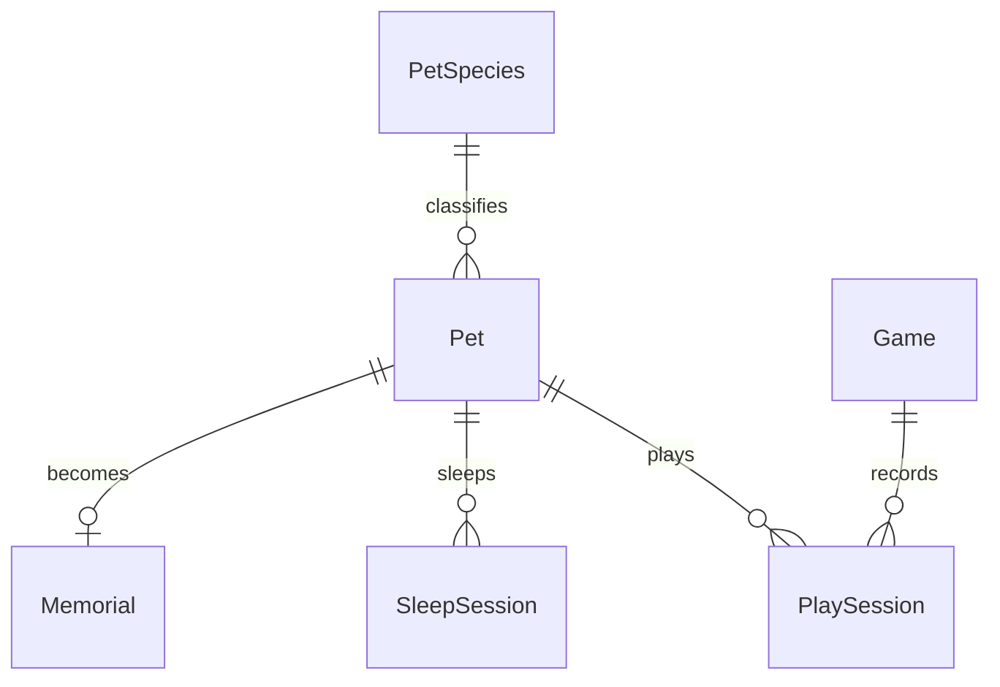

# 神秘蛋電子寵物：專題企劃與進度追蹤

> 從一顆蛋開始，陪伴小鳥長大。

- 更新日期：2026-10-01。
- 文件角色：產品需求與唯一進度台帳。直接查看 [第 10 節進度](#progress)、[文件導覽](README.md) 或 [歷史證據](development-history.md)。
- 版本依據：目前工作目錄的實際程式；未接入韌體的美術素材不視為功能已完成。
- 本文件整合舊企劃、現有程式、資料庫草圖與新增睡眠需求。附件中的建議視為規劃素材，不代表已採用或已實作。
- 第 1～9 節描述需求與程式結構，第 10 節唯一記錄實作／驗收／下一步；不再用單一核取框混合這三種狀態。
- 標記「建議／待決定」的內容是本次補充方案；未出現在程式裡的舊功能，不直接推定為團隊已決議刪除。

## 1. 專案目標與範圍

以 ESP32 NodeMCU-32S 製作可離線、獨立運作的電子寵物。玩家從神秘蛋開始，透過餵食、遊戲、清潔與休息培養寵物；第一版暫定只有小鳥一種寵物，後續再評估其他種類、環境互動與手機擴充。正式名稱、其他角色造型與數值平衡尚待決定。

開發範圍：

- **A：核心電子寵物**。OLED、搖桿含按壓開關、蜂鳴器、養成、存檔及基本省電；不以網路或感測器為必要條件。
- **B：環境互動**。優先評估 BH1750 明暗與睡眠整合；溫濕度、MPU6050 維持後續候選，不視為已確認採購或必做項目。
- **第二階段：手機與連線**。先做 Flutter 與 BLE 唯讀整合，再依授權與驗收依賴擴充；圖鑑、歷史資料、Wi-Fi／MQTT／伺服器／AI 依後續需求評估。進度只見第 10 節。

預期核心循環：神秘蛋 → 互動孵化小鳥 → 餵食／遊戲／清潔／休息 → 成長 → 保存並繼續養成。

## 2. 已確認的範圍

操作以搖桿整合；MVP 不含體力，只有小鳥一種，包含疾病、治療、死亡、墓碑與重養。一般睡眠與 Deep Sleep 分別承擔養成展示及省電用途。首版使用 NVS，不需要 SQL、網路或日曆時鐘。

決策沿革見 [開發歷史](development-history.md)，實作及驗收見 [進度台帳](#progress)。

## 3. 資料與程式依據

硬體與模組關係見 [架構](architecture.md)；OLED 規格見 [排版手冊](ui-layout-guide.md)；BLE 格式只在 [PROTOCOL.md](../esp32_pet_app/PROTOCOL.md) 維護。本節資料說明不是另一份完成清單。

### 3.3 寵物資料

目前 `PetData` 與 `PetSnapshotV1` 擁有：

- `petId`：新存檔從 1 開始；每次領養以當前寵物及墓碑群的最大 ID 加 1。在連續有效存檔內遞增，NVS 完全重建後可能重用；不是跨裝置或跨存檔代次的全域唯一鍵。
- `name`：ASCII 1～8 字元。新蛋自動產生固定六字母 ABB 名字，例如 `Tamama`；舊存檔的既有名字維持不變。
- `speciesId`：第一版固定為小鳥；`lifeStage` 為蛋、幼鳥、成鳥。舊存檔的已孵化數值 1 對應成鳥，維持格式相容。
- `satiety`：飽食度，初始 80，限制 0～100；數字越高越飽。
- `mood`：心情，初始 80，限制 0～100。
- `cleanliness`：清潔度，初始 100，限制 0～100。
- `level`：初始 1，型別 `uint8_t`；setter 將 0 修正為 1，最低等級為 1。
- `exp`：初始 0，型別 `uint16_t`；尚無升級或溢位處理規則。
- `healthState`：健康、生病、死亡三種互斥狀態；既有 `isSick()`、`isDead()` 查詢介面維持相同行為。
- `dangerSeconds` 與沿用舊欄位名的 `sickAwakeSeconds`：記錄連續危險暴露與生病後有效時間；清醒及一般睡眠都會累計。死亡時停止在 24 小時門檻，不把同批次超出的時間算入年齡或需求衰減。
- `ageSeconds`：累計有效生命秒數，包含清醒與一般睡眠，並隨寵物快照保存；真正斷電期間因尚無可信時間基準，不補算離線時間。
- 成鳥清醒衰減間隔：飽食 600 秒、清潔 900 秒、心情 1200 秒各降 1 點。幼鳥分別為 60／90／120 秒各降 1 點；蛋不衰減需求。各階段均保留未滿一輪的秒數。
- `PetSnapshotV1` 會保留三項衰減餘數、出生／死亡可信時間、死亡原因，以及一般／Deep Sleep 所需的模式與結算時間欄位。快照在還原前會完整驗證；UI 修訂號不保存。

已實作的衍生狀態區間：

- 飽食：76～100 飽足、51～75 稍餓、26～50 飢餓、11～25 很餓、0～10 極餓。
- 心情：81～100 非常開心、61～80 開心、41～60 普通、21～40 難過、0～20 非常難過。
- 清潔：76～100 乾淨、51～75 稍髒、26～50 髒、0～25 非常髒。

`Save` 已將上述欄位逐一序列化，以 CRC32 驗證並輪替寫入 Preferences／NVS A／B 槽；墓碑群使用獨立的固定格式 A／B 槽。啟動時載入序號較新的有效快照，無存檔才建立具新 ID 與 ABB 名字的蛋。蛋階段每分鐘及裂痕／孵化里程碑會建立檢查點，降低重開機造成的孵化進度回退。首版不提供名字輸入或日曆時間設定；睡眠功能進度見 A5-SLEEP／A6-S。體力不列入 MVP。

依據：[PetData 宣告](../src/pet/PetData.h)、[初始值與區間](../src/pet/PetData.cpp)。

## 4. 功能規劃與規則

### 4.1 執行順序

請依 [進度台帳的下一步](#progress) 執行；本節只維護玩法規則，不另存完成狀態。

### 4.2 養成、孵化與遊戲

- 餵食固定增加飽食度 `+20`；成功後回到主畫面播放約 3 秒的幼鳥／成鳥吃飯與碗逐步清空動畫。驗收追蹤見 A5-VIS。
- 清潔不建立大便事件、數量或額外存檔。幼鳥與成鳥依既有清潔度四階段顯示 0～3 個髒污圖：乾淨無髒污、稍髒 1 個、髒 2 個、非常髒 3 個。Clean 固定增加清潔度 `+30`，畫面依新階段減少或移除髒污。
- 髒污會出現在主畫面、3 秒餵食動畫及一般睡眠畫面，位置避開角色、碗、側邊狀態與 `Zzz`。目前不另做清潔動作動畫；清潔的視覺回饋就是髒污隨階段減少。驗收追蹤見 A5-VIS。
- 一般睡眠沿用主畫面兩側的心情、飢餓、髒污、生病及狀態圖示，但狀態圖示不顯示按鈕焦點框；中央顯示閉眼小鳥及靠近角色且不重疊的 `Z → Zz → Zzz` 動畫。畫面不提示起床操作，短按 SW 可起床。睡眠期間飽食、清潔、疾病及死亡照常推進，心情不下降並每 10 分鐘恢復 1；2026-10-01 起，恢復餘數在持續供電期間跨多次一般／省電睡眠累積，RTC 保留跨 Deep Sleep 的餘數，真正斷電或一般重開機則清除不足一輪的恢復餘數；不增加體力數值，寵物可能在睡夢中死亡。
- 孵化需保存「尚未孵化／已孵化」及小鳥種類；重開機不可重新播放出生或建立另一隻寵物。第一版不做種類抽選與機率設定。
- 第一版暫定只製作小鳥一種正式寵物，完成其孵化、待機與必要狀態畫面。其他種類與原定 3～5 種目標留待後續評估；寵物美術由使用者繪製，Agent 負責轉成韌體素材並接入。
- 第一個迷你遊戲採猜拳，取代原本一按心情 +15 的陪玩：固定三回合，平手也算一回合，整場贏／和／輸分別增加心情 15／10／5，第三回合揭曉時只結算一次。左右選招、短按確認、長按退出；蛋與生病時不能開始。規則及 128×64 版面見 [猜拳企劃](rps-game-plan.md)。第二種遊戲保留為原企劃 A 階段目標，接食物仍為候選；經驗／升級另做。
- 生命階段依有效年齡與健康狀態決定，不以 EXP 卡住成長；經驗值只用於後續等級與遊戲獎勵。蛋 4 分鐘顯示小裂痕、4 分 30 秒固定切換大裂痕、5 分鐘孵化，幼鳥再經 60 分鐘成鳥；成長點生病時延後至治療完成。

### 4.3 疾病、治療、死亡與重養（MVP 必做）

以下是交給實作 Agent 的**首版預設規則**，數值應集中設定，實機試玩後可調整，不要求人類先決定每個門檻：

1. 清醒及一般睡眠時，只要飽食或清潔至少一項持續為 0，累計 6 小時後生病；離開危險區間即清除尚未生病的連續計時。治療前畫面要明顯提示病情。
2. 增加「治療」操作，不消耗尚未定義的道具；治療使 `isSick=false` 並清除疾病倒數，但仍需餵食／清潔才能避免再次生病。先做可玩的明確規則，之後再評估道具系統。
3. 生病後累計 24 小時**有效時間**而未治療即死亡；一般睡眠不暫停疾病倒數，因此可能在睡夢中死亡。未來 Deep Sleep 結算也沿用相同規則。死亡前要有持續可見的警告，不能只在一次音效裡提示。
4. 死亡是終止狀態：立刻停止餵食、遊戲、治療與時間結算。原寵物資料轉成唯讀墓碑紀錄，含 `petId`、名字、種類及累計有效年齡；首版墓碑顯示「名字＋活了多久」，不要求日曆日期。同一死亡事件只能新增一次墓碑。
5. 顯示死亡／墓碑畫面，提供「查看墓碑群」與「領養新蛋」。領養新蛋產生新 `petId`，保留舊墓碑；主畫面顯示新蛋，不把已死亡寵物重設成活著。
6. 主選單增設「遊玩紀錄」入口，其中先提供「墳墓群」可翻看過去墓碑；逐局遊戲歷史可後做。MVP 先保留最多 32 筆；滿額時仍保存當前死亡墓碑，但需在開始下一隻之前提示使用者選擇一筆刪除並二次確認，不自動覆寫舊紀錄。後續若要永久累積，再設計匯出或外部儲存。
7. 不要求玩家輸入名字。新蛋建立時由 ESP32 硬體亂數產生六字母 ABB 名字：A 與 B 均為兩字母音節，組合成 `A+B+B`；A、B 相同時改用下一個 B，並對墓碑群中的同名最多重抽八次。名字與新 `petId` 立即保存，重開機、孵化與成長不重新命名。首版無須設定日期時間；完全斷電後不補算未知的離線時間。

### 4.4 自動命名規則

- A 前綴：`Ba Be Bo Da Do Fu Ha Ho Ka Ki Ko Ku Ma Mi Mo Na Ni No Pa Pi Po Ta Te To`。
- B 尾音：`ka ki ko ma mi mo na ni no pa pi po ra ri ro ru ta to`。
- 名字固定六個 ASCII 英文字母，首字母大寫，例如 `Tamama`、`Dororo`、`Kururu`；存檔欄位仍保留最多八字元。
- 同一寵物只在建立新蛋時命名一次；墓碑保存名字快照。歷代寵物允許極少數重名，裝置當前存檔內以 `petId` 識別；雲端歷史需另加存檔代次或 UUID。

疾病進度與墓碑群屬存檔資料。改版前應以「生病 → 治療 → 復發 → 死亡 → 看墓碑 → 領養新蛋 → 斷電續玩」做完整驗收；斷電或睡醒後不得重複新增墓碑。兩個門檻採累計有效時間，不以 `millis()` 跨重啟相減；無可信時間的真正斷電期間仍不補算。

## 5. 硬體與接線規劃

以下 GPIO 為目前程式設定，實際模組供電與接腳標示仍須核對：

- OLED：SDA → GPIO21、SCL → GPIO22，共地，I2C 地址 `0x3C`。使用符合模組規格且 I2C 訊號為 3.3V 的供電／上拉配置。
- 搖桿：VRX → GPIO34、VRY → GPIO35、SW → GPIO26；以 3.3V 供應電位器，避免類比輸出超過 ESP32 輸入範圍。SW 按下接地，未按為高。
- 蜂鳴器：控制訊號 → GPIO27；目前軟體按無源蜂鳴器設計。驅動方式須依實際蜂鳴器電流確認，必要時加電晶體，不能把未知負載直接當 GPIO 可供電元件。
- 文件中硬體代號有差異：程式註解寫 HW-504，需求寫 B103348；先核對實物是否為 VRX／VRY／SW 五腳搖桿，不直接視為完全相同型號。
- 類比輸入 GPIO34／35 保留給方向控制；睡眠喚醒使用 SW，不依賴持續讀取類比搖桿。

### 5.1 SW 喚醒接線

建議 SW／GPIO26 對 3.3V 加約 10kΩ 外接上拉、按鍵對 GND，並核對模組是否已內建上拉。上拉接常供電端；若未來關掉搖桿電位器電源，SW 仍必須可用。

GPIO26 是經典 ESP32 的 RTC GPIO，可採 `esp_sleep_enable_ext0_wakeup(GPIO_NUM_26, 0)` 設定低電位喚醒。一般執行時的 `INPUT_PULLUP` 不應被當成睡眠期間偏壓的唯一保證；若採內部上拉，依 RTC GPIO API 明確設定。醒來先 `rtc_gpio_deinit(GPIO_NUM_26)`，再恢復一般輸入初始化。此方案針對 NodeMCU-32S 的經典 ESP32，不套用 S2／S3／C3 的腳位表。[ESP32 睡眠模式文件](https://docs.espressif.com/projects/esp-idf/en/stable/esp32/api-reference/system/sleep_modes.html)

## 6. 一般睡眠與 Deep Sleep

### 6.1 一般睡眠：展示與遊戲狀態

- ESP32 及主迴圈保持運作，OLED 顯示閉眼小鳥及以 ASCII 繪製的 `Z → Zz → Zzz` 動畫。
- 睡眠中忽略方向操作，短按 SW 起床；畫面不顯示操作提示。飽食、清潔、年齡、疾病與死亡繼續更新，心情每 10 分鐘恢復 1。
- 建議 Rest 入口提供一般睡眠及省電睡眠的選擇，避免使用者把關屏誤認為當機。
- 展示模式可停用自動 Deep Sleep；省電模式可在閒置達門檻後轉入 Deep Sleep。門檻、夜間時段和允許喚醒的操作待決定。
- 一般睡眠的驗收範圍與日期只記於 A5-SLEEP。

### 6.2 Deep Sleep：省電狀態

- OLED 進入關屏／省電狀態，蜂鳴器停止輸出，ESP32 不執行一般主迴圈。
- 不持續播放動畫、音效、讀取 VRX／VRY 或透過一般 I2C 程式輪詢感測器。
- SW 或 Timer 喚醒後重新走啟動／初始化流程，不從睡眠函式後面繼續原本 UI。
- 正式版採手動睡眠、只由 SW 喚醒；相對時間 Timer 保留於測試版，閒置自動睡眠另行規劃；沒有可信時鐘前不承諾「每天晚上固定時間」自動入睡。

### 6.3 進入與恢復流程

1. 確認不在遊戲結算、孵化結果寫入等中途；先把當前寵物更新至現在。
2. 等待 SW 放開並穩定後才入睡。EXT0 是電位觸發，若仍按住會立刻醒來；等待期間仍允許取消，不使用無限阻塞等待。
3. 記錄睡眠開始時間、最後結算時間、保存版本與完整寵物狀態；檢查寫入結果，失敗則顯示錯誤並取消入睡。
4. 停止音序並確保蜂鳴器睡眠時不會浮接鳴叫；由 Display 封裝新增 OLED 省電介面，僅清空畫面不等於關屏。
5. 配置 RTC 記憶體、SW 與 Timer 喚醒來源，檢查 API 回傳值，最後呼叫 `esp_deep_sleep_start()`。
6. 開機最前端辨識 `esp_sleep_get_wakeup_cause()` 與重置原因；選擇有效 RTC 快照或 NVS 存檔，而非先建立新寵物覆蓋。
7. 計算實際經過時間，套用一次狀態更新，推進最後結算時間；再次睡眠不得重複累算同一時段。
8. 恢復一般 GPIO、I2C、OLED、音效與輸入。把此次喚醒按壓消耗掉，放開後才接受新的操作。
9. Deep Sleep 的 RTC 檢查點保留有效搖桿中心校正，醒來交給 `Input::init(savedCenterX, savedCenterY)`，避免搖桿仍偏移時被當成中心；一般冷開機才重新校正。
10. 使用者真正起床時回主畫面；首版不另做起床動畫。B 階段若加入定時量光而繼續睡眠，再設計不點亮 OLED 或播放音效的流程。

### 6.4 Timer 與時間基準

Timer 以相對時間設定，例如 `esp_sleep_enable_timer_wakeup(60ULL * 1000000ULL)` 為 60 秒測試；測試版 SW 與 Timer 可同時啟用，先發生者喚醒；正式版停用 Timer，每次喚醒最多結算 48 小時，超出時間捨棄。API 與 RTC 保留行為需以專案實際安裝的 Arduino／ESP-IDF 版本編譯及上板確認，不能因官方最新文件有某 API 就假設本機版本相同。[ESP32 睡眠模式文件](https://docs.espressif.com/projects/esp-idf/en/stable/esp32/api-reference/system/sleep_modes.html)

**不要跨 Deep Sleep 以 `millis()` 差值計算睡眠，也不要把設定的 Timer 時長當作實際睡眠時間**，因為 SW 可能提早喚醒。

建議睡前／醒後透過 RTC 支援的系統時間（如 `gettimeofday()`）取差值，保留同一時間基準；醒來不要任意重新設定時間。RTC 系統計時可跨 Deep Sleep，但斷電後無法靠它知道經過多久，且內部時鐘可能漂移。[ESP32 系統時間文件](https://docs.espressif.com/projects/esp-idf/en/stable/esp32/api-reference/system/system_time.html)

- 無網路首版：正式版只由 SW 喚醒，獨立測試版另有 60 秒 Timer 喚醒；目前沒有自選睡眠時長介面。年齡以累計有效秒數計算。
- 若要「22:30 睡、07:00 醒」，先要有可信日期／時間，例如手動設定且持續供電，或未來加具備備援電源的外部 RTC；網路校時僅是後續可選項。
- 真正斷電且無可信時鐘：讀回最後存檔，**不猜測離線時長**；該未知時段不衰減或恢復，也不要求使用者設定日曆時間才能繼續遊玩。
- 睡眠結算建議：`elapsed = max(0, now - lastUpdatedAt)`；設定合理的補算上限與餘數累積方式，避免過長離線導致暴增或短週期四捨五入損失。恢復速率、飢餓衰減、年齡是否含睡眠都須形成明確規則。
- 8.5 小時等於 30,600 秒，只能在時間基準有效時依此結算；睡眠會更新年齡、需求、心情及疾病倒數，並可能在結算時死亡。

### 6.5 保存策略

`Preferences` 是 Arduino 封裝，NVS 是其使用的非揮發性儲存機制，資料存於 Flash；它們不是三個互不相關的保存選項。[Preferences 官方文件](https://docs.espressif.com/projects/arduino-esp32/en/latest/api/preferences.html)

- **RTC Memory**：使用 `RTC_DATA_ATTR` 保存小型快照、睡眠時間與結算資訊，供 Deep Sleep 快速恢復；不能作為斷電保存的唯一依據。
- **Preferences／NVS**：保存可斷電恢復的寵物檢查點。首版建議手動入睡前、孵化完成及重要里程碑寫入，平常合併變更後限頻保存，不每幀／每秒寫 Flash。
- B 階段頻繁定時量光再睡時，以 RTC 更新為主，NVS 按既定檢查點保存，文件與 UI 應說明突然斷電最多可能損失多少近期進度。
- 存檔包含 magic、`schemaVersion`、長度、序號與校驗資訊；使用明確欄位序列化，不直接保存含指標的物件或依賴 C++ 結構 padding。
- 建議用完整快照搭配 A／B 槽與有效性檢查，寫入新槽確認成功後才採用；避免多個 key 寫到一半形成混合版本。
- 載入順序：有效且符合此次 Deep Sleep／版本的 RTC 快照 → 最新有效 NVS 快照 → 無存檔時才建立新寵物。損毀或不支援版本應提示，不能靜默覆蓋唯一舊存檔。
- 新增寵物身分、疾病計時與墓碑等欄位時，定義舊版本遷移與預設值；存檔錯誤、NVS 空間不足及斷電中斷寫入納入驗收。墓碑寫入成功後才能提供「領養新蛋」。

### 6.6 電池與整機耗電

Deep Sleep 是本次新增的軟體目標，**尚不能據此承諾續航天數**。NodeMCU-32S 板上的電源指示燈、USB 轉序列晶片、穩壓器，以及 OLED 模組、搖桿電位器和蜂鳴器驅動都可能持續耗電；晶片睡眠電流不等於整台裝置電流。

- 確認電池種類／容量、充電保護與供電轉換方案，再依實際板卡規格確認供電入口；不直接把未穩壓電池當作 3.3V 電源。
- 分別量測正常操作、一般睡眠、Deep Sleep、定時喚醒期間的整機電流，記錄電壓與 USB 是否連接。
- 以實測平均電流、可用容量與轉換損耗估算續航。
- 若 Deep Sleep 仍耗電高，再評估切斷 OLED／搖桿電位器電源、低靜態電流穩壓器或其他板卡；不在第一版直接修改未知開發板電路。
- 外設斷電時檢查 I2C／GPIO 是否反向供電，並維持 SW 喚醒電路常供電。

## 7. BH1750 與環境互動（B 階段）

BH1750FVI 的標準接腳沒有明暗門檻 INT／警報輸出，不能直接規劃成「BH1750 發中斷喚醒 ESP32」。若要硬體即時明暗喚醒，需另選帶中斷的感測器或增加比較器等電路，屬於另一個硬體方案。[ROHM BH1750FVI 原廠資料表，由 WEMOS 提供副本](https://www.wemos.cc/en/latest/_static/files/bh1750fvi-tr.pdf)

第一版採定時輪詢：

1. BH1750 與 OLED 共用 SDA21／SCL22；核對模組供電、3.3V 上拉與地址，BH1750 常用 `0x23` 或 `0x5C`，不同於 OLED `0x3C`。
2. Timer 喚醒 → 初始化必要硬體 → 發出量測命令並等候量測完成 → 讀取照度。
3. 仍暗：更新時間結算，讓感測器進入低耗電模式，再次 Deep Sleep。
4. 夠亮：恢復使用者操作、OLED 與起床動畫；SW 喚醒則優先尊重玩家操作，不因房間暗就立即睡回去。
5. 建議先試每 5～15 分鐘量一次，作為待調參數；不是全天連續 I2C 讀取，也不是已確認規格。
6. 使用不同入睡／起床照度門檻及連續確認次數，避免陰影、開燈造成反覆切換。
7. 感測器遺失或讀取失敗應保留手動／Timer 模式，不永久卡住或禁止玩家喚醒。

溫濕度與 MPU6050 後續先確認可帶來的互動，再決定是否實作。不要在主 CPU 深睡時假設一般感測迴圈仍運作。

## 8. 資料模型：由草圖整理為可實作版本

這是**邏輯模型提案**，目前 ESP32 沒有 SQL 資料庫，也不需為了 ER 圖導入資料庫伺服器。A 階段可用 C++ 資料結構、固定資源目錄與 NVS 快照；完整歷史紀錄留給後續有需求的儲存／App。

### 8.1 草圖的關係修正

- 「寵物種類 1 → N 寵物」成立：同一種類可有多隻寵物；MVP 裝置先只有一隻當前寵物。
- 「遊玩」應連接**寵物與遊戲**，不接在「心情值」屬性上；心情變動是結果，不是關係主體。
- 同一寵物可多次玩同一遊戲，因此抽成有獨立 ID 的 `PlaySession`，不能只拿 `petId + gameId` 當唯一紀錄鍵。
- 生命階段依有效年齡與健康判定並寫入快照，不由等級推導；未來分支進化需另定存檔規格。
- 「圖像編號」若只指一張靜態預設圖可放種類；若含不同階段、表情、動畫幀，建議改為資源集合或獨立 Asset 定義。

```mermaid
erDiagram
    PetSpecies ||--o{ Pet : classifies
    Pet ||--o{ PlaySession : plays
    Game ||--o{ PlaySession : records
    Pet ||--o{ SleepSession : sleeps
    Pet ||--o| Memorial : becomes
```

本專案採蛋與寵物共用同一身分；領養即建立 petId 並固定為 Bird，孵化只改生命階段，不另建個體。

### 8.2 建議實體與欄位

**PetSpecies：靜態種類目錄提案。**

- `speciesId` 主鍵、`speciesName`、`assetSetId`；第一版目錄只需小鳥一筆，不設種類抽選機率，保留欄位與關係供日後擴充。
- 圖像資料先放韌體資源，不把整張 bitmap 重複寫入每隻寵物的 NVS。

**Pet：當前寵物快照。**

- `PetSnapshotV1` 已定義 `petId`、ASCII 名字、小鳥種類、蛋／幼鳥／成鳥階段、三項需求、等級、經驗、互斥健康狀態與年齡。
- 已納入三項衰減餘數、單一連續危險時間、生病後有效時間（快照欄位沿用舊名 `sickAwakeSeconds`）、各自帶有效性標記的出生／死亡時間、死亡原因，以及睡眠模式與睡眠結算時間。
- `SaveEnvelopeV1` 已定義 magic、schemaVersion、payloadSize、sequence 與 CRC32 欄位；版本 1 使用固定 92-byte payload、108-byte 完整紀錄及 NVS A／B 槽。
- 快照逐欄位以 little-endian 編碼，不直接寫入 C++ 結構，避免 padding 或 enum 表示方式改變存檔。
- 飢餓／心情／清潔分級從數值推導，不重複保存；死亡後不得再切回存活狀態，並需對應墓碑紀錄。

**Game：靜態遊戲目錄提案。**

- `gameId` 主鍵、`gameName`；必要時增加規則版本，供未來比較分數。

**PlaySession：一次遊玩結果提案。**

- `sessionId` 主鍵、`petId` 與 `gameId` 外鍵、`result`、`score`。
- 拆清楚 `startedAt`（有有效時鐘才填）與 `durationSeconds`，不要讓「遊玩時間」混用開始時刻和耗時。
- 可選擇保存獎勵／心情／經驗變化，並確保重開機不重複領取。
- MVP 建議只存次數與最高分等摘要；若要逐局歷史，先訂筆數上限／循環覆寫策略。

**SleepSession：睡眠處理資料提案。**

- `sleepId`、`petId`、`mode`、`startedAt`、`endedAt`、`elapsedSeconds`、`wakeReason`、`timeValid`。
- MVP 僅需目前睡眠快照與最後結算時間，完整歷史並非 Deep Sleep 的先決條件。
- Timer 量光只是同一次睡眠中的檢查；以最後結算時間避免重複更新心情／年齡，不把每次檢查都當玩家起床。

**Memorial：死亡寵物的唯讀墓碑紀錄，MVP 必做；驗收見 A6-MEM。**

- `petId` 為唯一鍵；首版保留 `name`、`speciesId`／種類顯示名及 `ageSeconds`，可加死亡原因。既有寵物快照中的 `bornAt`／`diedAt` 可保留供日後擴充，首版墓碑不依賴或顯示日曆時間。
- 墓碑顯示名字與有效累計年齡（活了多久）；沒有外接 RTC 也能完成墓碑與重養。
- 存檔需保證同一 `petId` 最多一筆墓碑、死亡事件不重入；墓碑群滿額時由玩家明確刪除才能繼續領養。

## 9. 軟體分工與擴充位置

目前：

- `src/main.cpp`：Application 擁有唯一 PetData，協調輸入、UI、音效與保存物件。
- `src/hardware/`：硬體介面；UI 不直接讀 GPIO 或操作 U8g2。
- `src/ui/`、`include/ui/`：畫面狀態、圖示與中文字圖。
- `src/pet/`：寵物資料、界限與衍生狀態。
- `src/storage/`：保存邊界；當前寵物與墓碑群均使用版本化、CRC32 保護的 NVS A／B 槽。
- `include/HardwareConfig.h`：GPIO 與硬體參數的集中來源。
- `src/ble/`：NimBLE 唯讀服務、固定裝置 ID、分片收送；格式見共用協定。

後續建議新增寵物行為／時間更新、遊戲、電源／睡眠管理及時間服務模組，名稱於實作時決定。資料變更由應用／領域邏輯負責，UI 只送出意圖與顯示結果；保存負責序列化，睡眠管理負責協調入睡與恢復。正常互動維持非阻塞更新，不以長時間 `delay()` 實作睡覺。

## 10. 唯一進度台帳

最後核對：2026-10-01。目前核心 A3～A6 部分完成；BLE Stage 2 基本連線／通知／一次重連已實機確認，完整穩定性仍待驗收；Deep Sleep 已實作並有測試版實機證據；第一個小遊戲猜拳已實作、基本操作與心情 BLE 通知已實機確認，第二個遊戲與 Web 雲端功能未實作。

**實作**使用「未實作／部分實作／已實作／選配未啟動」；**驗證**分別記錄建置、自動測試、實機及其版本／日期。舊版實測不自動延伸到目前 NimBLE 版；下列「歷史通過」是已存文件中的使用者回報，本次未重跑硬體。

**下一步順序**：猜拳基本操作與心情 BLE 即時同步已有實機回報；接著補存檔及特殊中斷情境、回歸目前正式版省電睡眠，再規劃經驗／升級與第二個遊戲。BLE 長時間與反覆重連驗收持續追蹤；Web 組可依既定協定並行開始 W0／W1。Stage 3 遠端操作仍須先通過 Stage 2 實機驗收。

### 韌體與裝置（負責：韌體組；實機回報：使用者）

- **A1-HW｜硬體、輸入與音效** — 實作：已實作。驗證：2026-10-01 建置通過；新版完整硬體回歸待做。下一步：記錄板型、接線、顯示、方向／短長按及音效；依據 `src/hardware/`、`include/HardwareConfig.h`。
- **A2-UI｜主畫面、中文選單及狀態頁** — 實作：已實作。驗證：2026-09-28 歷史畫面／照顧操作通過；Status 長按返回、最長文字及最新版本回歸待補。下一步：依 [排版手冊](ui-layout-guide.md) 驗收；依據 `src/ui/UiController.cpp`。
- **A3-CORE｜需求、年齡、疾病、治療與死亡** — 實作：已實作。驗證：歷史回報數值下降及死亡畫面正常；正式 6 小時／24 小時門檻尚未完整實測。2026-10-01 猜拳增量已重跑完整 `test/pet_core_native.cpp`，門檻、分段／溢位及睡眠案例通過，見 [猜拳驗收](rps-game-test.md)。下一步：補正式時長及疾病跨重啟證據；依據 `src/pet/`。
- **A3-EXP｜經驗與升級** — 實作：僅資料欄位，規則未實作。驗證：無玩法驗收。下一步：和遊戲獎勵一起確定上限、門檻與一次性結算。
- **A4-GROW｜蛋／幼鳥／成鳥與 ABB 命名** — 實作：已實作。驗證：2026-09-28 階段畫面、命名、重養及正常重開機歷史通過；2.4 秒轉場細節、正式成長節奏待專項確認。下一步：使用 growth 測試環境，另評估較完整破殼動畫；依據 `PetData`、`PetName`、`UiController`。
- **A5-CARE｜餵食、清潔、治療及陪玩入口** — 實作：已實作；1.3.0 起 Play 進猜拳，不再按一下直接 +15，獎勵見 A5-GAME。驗證：2026-09-28 照顧操作歷史通過；不涵蓋後來的動畫及猜拳。下一步：新版回歸。
- **A5-VIS｜餵食動畫與四階髒污** — 實作：已實作。驗證：2026-10-01 正常及 dirty_preview 建置通過，正式畫面實機待驗收。下一步：依 [預覽操作](dirty-preview.md) 檢查後，再測正常版 Clean；依據 `PetIcons`、`UiController`、`dirty_preview.cpp`。
- **A5-SLEEP｜一般睡眠** — 實作：已實作。驗證：2026-09-28 畫面、短按起床、數值及睡夢死亡歷史通過；不足 10 分鐘的心情恢復餘數未保存於 NVS 快照；本次改為持續供電時跨多次睡眠保留，並以 RTC 跨 Deep Sleep 保留，一般重啟／完全斷電仍清除。2026-10-01 使用者確認目前 NimBLE 版一般睡眠與起床正常；此次未驗證心情餘數或睡夢死亡。下一步：餘數規則驗收；依據 `PetData::restore`、`beginNormalSleep`、`main.cpp`。
- **A5-GAME｜小遊戲** — 實作：第一個猜拳已實作，韌體 1.3.0；三回合、選招／倒數／揭曉／總結果／再玩、健康限制、一次性心情獎勵及既有保存／BLE 狀態路徑已接入；2026-10-02 改用使用者提供的 `assets/GAME/Rock-Paper-Scissors.png`，保留三張 24×18 手勢原像素。驗證：2026-10-01 領域九種配對／27 種三回合序列、實際 UI 流程及寵物核心原生測試通過，17 張同字型／繪圖預覽已檢查；使用者回報猜拳實機操作均正常，且猜拳後手機心情值即時更新，確認既有 BLE 狀態通知涵蓋遊戲獎勵。2026-10-02 素材替換後原生測試與正式韌體編譯通過，已更新畫面預覽，新圖尚未上板驗收。建置數據及上板步驟見 [猜拳驗收](rps-game-test.md)。十場連續遊玩、特殊中斷、重連及存檔邊界未逐項回報。下一步：確認新圖實機顯示及這些邊界情境；第二種遊戲及 EXP／升級仍待做。
- **A6-SAVE｜當前寵物 NVS** — 實作：已實作。驗證：2026-09-28 正常重啟續玩歷史通過；2026-10-01 使用者確認目前 NimBLE 版正常重開機保存正常；突然斷電、寫入中斷、損毀槽及舊版遷移待測。下一步：故障情境驗收；依據 `src/storage/Save.cpp`、`SaveFormat.h`。
- **A6-MEM｜墓碑與重養** — 實作：已實作，32 筆＋1 個死亡溢位槽。驗證：2026-09-28 一般容量的瀏覽／刪除／領養／重啟歷史通過；滿額與寫入故障待驗收。下一步：memorial 測試環境驗證第 33 筆、不可刪當前死亡個體及刪除後領養；依據 `Memorials`、`main.cpp`。
- **A6-S｜Deep Sleep** — 實作：已實作，韌體 1.2.1；休息頁可選一般／省電睡眠，正式版只由 SW 喚醒、不自動起床，獨立 pet-deep 測試版 60 秒。睡前 NVS 驗證、RTC 校驗快照／相對時間、Timer／SW 喚醒、一次性結算、OLED 關屏／蜂鳴器 LOW／NimBLE 停止、睡醒重廣播、SW 消耗與保留中心校正已接入；NVS V1 格式不變，真正斷電不補算，時間倒退拒絕補算；超過 48 小時最多結算 48 小時。驗證：2026-10-01 原生寵物測試通過，包含 Deep 結算、恢復餘數、跨多次短睡及死亡截斷；最終環境建置結果見 [深睡驗收文件](deep-sleep-test.md)。1.2.0 歷史實機結果：2026-10-01 使用者確認 deep_sleep_test 的 60 秒 Timer 自動喚醒及 SW 提早喚醒均成功。使用者續報四項驗收皆正常：入睡 OLED 關屏／蜂鳴器靜音／手機 BLE 斷線、醒後手機重連及年齡／心情更新、SW 喚醒後按住數秒不誤開選單且放開可操作、至少五次反覆睡醒不卡住或重置資料。此回報確認基本數值更新，未提供逐秒結算／餘數的數據比對。使用者再確認搖桿偏移時 SW 喚醒、回中後四方向正常，以及睡眠中拔電後重新供電保留寵物／可操作／不補算未知斷電時間均正常。至此 deep_sleep_test 基本操作與斷電恢復已實機通過；寫入中斷／存檔故障、睡夢死亡、精確餘數比對、1.2.1 正式版不自動喚醒／長睡上限、RTC 漂移與整機耗電仍待專項驗收。下一步：可燒回正式 esp32dev 確認超過一小時不自動醒、SW 喚醒正常，長睡與耗電後續追蹤；BLE 行為依 [共用規格](../esp32_pet_app/PROTOCOL.md)。
- **A7｜離線整合** — 實作：第一個遊戲與睡眠已接入，原目標中的第二種遊戲仍未實作。驗證：猜拳基本操作已實機確認，完整長時間養成／遊戲／存檔／睡眠流程尚未驗收。下一步：完成第二種遊戲及各邊界驗收後，在無手機／網路／日曆／感測器下展示完整離線循環，確認不鎖死或重複結算。
- **B1～B4｜環境互動與電池** — 實作：未實作。驗證：未量測。下一步：先確認 BH1750／電池與供電；明暗 Timer 輪詢及遲滯，失敗退回手動；溫濕度／MPU6050 待選定用途。需量測各模式整機耗電與反向供電風險，之後才設定續航承諾。

### BLE 與 App（負責：韌體組＋Web 組）

- **BLE-S1｜共用規格** — 實作：v1 已定義。驗證：已與目前欄位／UUID／16-byte 分片對照；協定健壯性測試仍待補。Flutter 對不支援的頂層 v 會直接忽略，device_info 版本不符只提示，尚未完整落實規格要求的停止命令流程。下一步：補齊此錯誤處理與測試，以 [PROTOCOL.md](../esp32_pet_app/PROTOCOL.md) 為單一介面來源。
- **BLE-S2｜唯讀連線** — 實作：已實作；2026-10-01 網頁搜尋移除名稱二次篩選，沿用服務 UUID 篩選及連線時的服務／特徵驗證，允許手機快取的舊名稱。驗證：韌體建置與 Flutter analyze／Web release 通過；使用者於 2026-10-01 回報 firmware=1.1.0 初始化無失敗訊息，手機搜尋到 EmmaBT，且該項隨 ESP32 斷電消失、供電重新出現。名稱修正及手機端排除步驟後，使用者回報 Android Chrome 成功連線，實體餵食後網頁飽食度立即增加，確認基本連線、狀態讀取及通知同步；使用者補充：在手機取消 EmmaBT 配對後，再次搜尋顯示 ESP32-PET，支持舊配對資料保留名稱的判斷；服務讀取錯誤是否由相同原因造成仍未單獨驗證。使用者後續確認一次中斷後重新連線正常，網頁裝置 ID 為 esp32-20500D0867A4，並確認一般睡眠／起床／正常重開機保存正常。反覆查詢／十次重連、離線養成及長時間穩定性仍待實機，不視為完整 Stage 2 驗收。下一步：基本前置回歸已具備，可進入 Deep Sleep 開發；其餘依 [2026-10-01 驗收步驟](firmware-capacity-handoff.md#建置及實機驗收)。
- **FW-CAP｜NimBLE／device_id** — 實作：已實作。驗證：2026-10-01 六環境建置通過，容量改善達初期目標；ID 穩定性、heap 與硬體回歸待測。最新量測見 [當日容量紀錄](firmware-capacity-handoff.md#容量結果)，本處不複製數字。下一步：實機驗收，目前無須更改分割區。
- **APP-NATIVE｜原生 App** — 實作：沿用 Flutter 原始碼，原生交付未完成。驗證：Windows／Android／iOS 未建置或實機驗收。下一步：確認實際需求及 FlutterBluePlus 支援後配置各平台；不可說已有可安裝替代 App。
- **BLE-S3｜遠端命令** — 實作：未實作。驗證：無。下一步：BLE-S2 通過後才設計授權、去重、效期、目標個體與失去回覆流程；與 Web W3／W5 協調。

### Web 階段（負責：Web 組；裝置擴充由韌體組負責）

下列狀態依目前倉庫實作判定；已加入獨立 Web 展示，但尚無 server／帳號等實作。Flutter 唯讀原型不等於 Web W0～W7 全部完成。工作內容與驗收條件只在 [Web 計畫](web-phase-plan.md) 定義。

- **W0｜邊界與基線** — 部分前置具備：FW-CAP 已提供 build 數據；團隊 Flash 實物、OTA、瀏覽器、登入／部署候選、資料保留決策待確認。下一步：兩組交接，不重做 NimBLE 遷移。
- **W1｜瀏覽器 BLE 驗收** — 未完成；已有唯讀原型，待實機相容矩陣。與 BLE-S2 共用同一次驗收證據。
- **W2｜網站外殼／登入／API 環境** — 實作：部分實作，2026-10-01 新增獨立 `web-preview/` 像素小鳥展示頁（提交 `7545809`），2026-10-02 合入 main；含背景、生命階段／睡眠／生病切換、揮翅／走動與照顧模擬回饋。尚未接入 Flutter Web，登入／登出、裝置／帳號頁、API、DB migration、session／CSRF／CORS 均未實作；不代表 W2 驗收完成。驗證：初版 JavaScript 語法檢查與桌面畫面查看，2026-10-01 使用者回報可開啟並逐次提供美術回饋；最新版完整自動測試／行動版／實機 BLE 未驗收。展示數值不是真實裝置狀態；詳細當日記錄見 [Web 交接](../web-preview/SESSION-2026-10-01.md)。下一步：建立網站外殼與分離的 mock／BLE 資料層，再依 Web 計畫建立帳號及 API 環境。
- **W3｜配對及擁有權** — 未實作；公開 device_id 不提供認領證明，需兩組共同設計實體配對。
- **W4｜狀態上雲** — 未實作；資料模型、revision／session 語意及帳號權限待定。
- **W5｜養成命令** — 未實作；依賴 W1、W3 與 BLE-S3。
- **W6｜歷史／紀念館** — 未實作；依賴 saveGeneration／UUID、事件來源與補傳設計。單靠 petId 不足。
- **W7｜部署及展示** — 未實作；待前述階段完成與整合驗收。
- **W8｜常駐 Wi-Fi 雲端** — 選配未啟動；只有確認瀏覽器關閉仍須遠端操作才評估。

### 跨功能待決策

- **DEC-01**：Deep Sleep 閒置門檻與展示模式；正式版 SW 喚醒及最多結算 48 小時已確認；一般睡眠心情每 10 分鐘 +1 已有規則，不重列為未決。
- **DEC-02**：電池、供電與續航目標，依 B 階段實測決定；首版不需外接日曆 RTC。
- **DEC-03**：是否保留逐局遊戲／完整睡眠歷史；本機首版可先摘要，雲端歷史與 W6 分開設計。

## 11. 待團隊決定與追蹤方式

### 已確認的產品決定

- 本專案主要由 Agent 撰寫程式與補齊可測試的細節；人類提供想法、硬體資訊與實機測試回報。Agent 遇到影響硬體採購、使用者資料或體驗方向的大決策才請人類決定。
- MVP 不加入體力。一般睡眠與 Deep Sleep 使用心情、年齡與疾病計時形成效果；若未來遊戲明確需要體力，再以新功能提案加入。
- MVP 包含疾病、治療、死亡、墓碑群及新蛋重養；第 4.3 節為首版預設規則。
- MVP 墓碑只顯示名字與活了多久；現實日期時間不是必要功能，完全斷電期間不補算。外接 RTC 與墓碑日期留待後續有需求時再評估。
- 第一版暫定只有小鳥一種寵物，每顆蛋都孵出小鳥；不同個體仍有各自的 ID、名字與墓碑。其他種類列為後續擴充，正式寵物美術由使用者繪製。
- 清潔不做大便生成玩法。清潔度四階段直接對應 0～3 個髒污圖，按下 Clean 使清潔度 `+30`，髒污依新階段減少或消失；不另存髒污數量，也不另做清潔動作動畫。
- README 是接手與建置入口；實作與驗收只在第 10 節更新。

### 更新方式

每次實作只更新第 10 節對應項目的實作、驗證證據與下一步；規則改變才改本文件需求段落。API／BLE 改變更新 PROTOCOL，建置方法改變更新 README。不要在每份文件複製進度。

每筆驗證至少寫日期、適用版本／工作目錄、方法、結果與未測範圍。詳細建置與實測報告以有日期的紀錄保存，台帳只連到最新證據。沒有新硬體回報，不把待驗收改成通過。

過去決策與使用者回報見 [開發歷史](development-history.md)。文件角色與修改觸發條件見 [文件導覽](README.md)。

