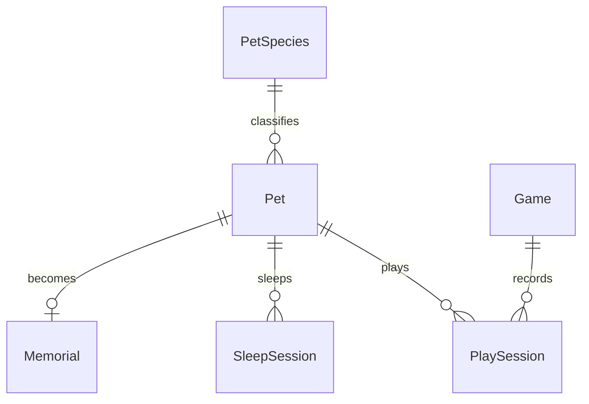

# 神秘蛋電子寵物：專題企劃與進度追蹤

> 從一顆蛋開始，陪伴小鳥長大。

- 更新日期：2026-10-08。
- 文件角色：產品需求與唯一進度台帳。直接查看 [第 10 節進度](#progress)、[文件導覽](README.md) 或 [歷史證據](development-history.md)。
- 版本依據：目前工作目錄的實際程式；未接入韌體的美術素材不視為功能已完成。
- 本文件整合舊企劃、現有程式、資料庫草圖與新增睡眠需求。附件中的建議視為規劃素材，不代表已採用或已實作。
- 第 1～9 節描述需求與程式結構，第 10 節唯一記錄實作／驗收／下一步；不再用單一核取框混合這三種狀態。
- 標記「建議／待決定」的內容是本次補充方案；未出現在程式裡的舊功能，不直接推定為團隊已決議刪除。

## 1. 專案目標與範圍

以 ESP32 NodeMCU-32S 製作可離線、獨立運作的電子寵物。玩家從神秘蛋開始，透過餵食、遊戲、清潔與休息培養寵物；第一版暫定只有小鳥一種寵物，後續再評估其他種類、環境互動與手機擴充。正式名稱、其他角色造型與數值平衡尚待決定。

開發範圍：

- **A：核心電子寵物**。OLED、搖桿含按壓開關、蜂鳴器、養成、存檔及基本省電；不以網路或感測器為必要條件。
- **B：環境互動**。優先評估 BH1750 明暗與睡眠整合；溫濕度、MPU6050 維持後續候選，不視為已確認採購或必做項目。
- **第二階段：手機與連線**。先做 Flutter 與 BLE 唯讀整合，再依授權與驗收依賴擴充；圖鑑、歷史資料、Wi-Fi／MQTT／伺服器／AI 依後續需求評估。進度只見第 10 節。

預期核心循環：神秘蛋 → 互動孵化小鳥 → 餵食／遊戲／清潔／休息 → 成長 → 保存並繼續養成。

## 2. 已確認的範圍

操作以搖桿整合；MVP 不含體力，只有小鳥一種，包含疾病、治療、死亡、墓碑與重養。一般睡眠與 Deep Sleep 分別承擔養成展示及省電用途。首版使用 NVS，不需要 SQL、網路或日曆時鐘。

決策沿革見 [開發歷史](development-history.md)，實作及驗收見 [進度台帳](#progress)。

## 3. 資料與程式依據

硬體與模組關係見 [架構](architecture.md)；OLED 規格見 [排版手冊](ui-layout-guide.md)；BLE 格式只在 [PROTOCOL.md](../esp32_pet_app/PROTOCOL.md) 維護。本節資料說明不是另一份完成清單。

### 3.3 寵物資料

目前 `PetData` 與 `PetSnapshotV1` 擁有：

- `petId`：新存檔從 1 開始；每次領養以當前寵物及墓碑群的最大 ID 加 1。在連續有效存檔內遞增，NVS 完全重建後可能重用；不是跨裝置或跨存檔代次的全域唯一鍵。
- `name`：ASCII 1～8 字元。新蛋自動產生固定六字母 ABB 名字，例如 `Tamama`；舊存檔的既有名字維持不變。
- `speciesId`：第一版固定為小鳥；`lifeStage` 為蛋、幼鳥、成鳥。舊存檔的已孵化數值 1 對應成鳥，維持格式相容。
- `satiety`：飽食度，初始 80，限制 0～100；數字越高越飽。
- `mood`：心情，初始 80，限制 0～100。
- `cleanliness`：清潔度，初始 100，限制 0～100。
- `level`：初始 1，型別 `uint8_t`；限制 Lv1～Lv20，setter 將 0 修正為 1。
- `exp`：初始 0，型別 `uint16_t`，表示本級進度；升級需求為 `50 + 25 × (level − 1)`，保留餘額並支援跨多級。Lv20 滿等，EXP 固定 0；玩法與驗收見 [經驗與升級](exp-level-plan.md)。
- `healthState`：健康、生病、死亡三種互斥狀態；既有 `isSick()`、`isDead()` 查詢介面維持相同行為。
- `dangerSeconds` 與沿用舊欄位名的 `sickAwakeSeconds`：記錄連續危險暴露與生病後有效時間；清醒及一般睡眠都會累計。死亡時停止在 24 小時門檻，不把同批次超出的時間算入年齡或需求衰減。
- `ageSeconds`：累計有效生命秒數，包含清醒與一般睡眠，並隨寵物快照保存；真正斷電期間因尚無可信時間基準，不補算離線時間。
- 成鳥清醒基礎衰減間隔：飽食 600 秒、清潔 900 秒各降 1 點，心情每 1200 秒扣 1／2／3 點（依第 4.2.1 節低需求項目數）。幼鳥飽食／清潔每 60／90 秒各降 1 點，心情每 120 秒扣 1／2／3；蛋不衰減需求。各階段均保留未滿一輪的秒數。
- `PetSnapshotV1` 會保留三項衰減餘數、出生／死亡可信時間、死亡原因，以及一般／Deep Sleep 所需的模式與結算時間欄位。快照在還原前會完整驗證；UI 修訂號不保存。

已實作的衍生狀態區間：

- 飽食：76～100 飽足、51～75 稍餓、26～50 飢餓、11～25 很餓、0～10 極餓。
- 心情：81～100 非常開心、61～80 開心、41～60 普通、21～40 難過、0～20 非常難過。
- 清潔：76～100 乾淨、51～75 稍髒、26～50 髒、0～25 非常髒。

`Save` 已將上述欄位逐一序列化，以 CRC32 驗證並輪替寫入 Preferences／NVS A／B 槽；墓碑群使用獨立的固定格式 A／B 槽。啟動時載入序號較新的有效快照，無存檔才建立具新 ID 與 ABB 名字的蛋。蛋階段每分鐘及裂痕／孵化里程碑會建立檢查點，降低重開機造成的孵化進度回退。首版不提供名字輸入或日曆時間設定；睡眠功能進度見 A5-SLEEP／A6-S。體力不列入 MVP。

依據：[PetData 宣告](../src/pet/PetData.h)、[初始值與區間](../src/pet/PetData.cpp)。

## 4. 功能規劃與規則

### 4.1 執行順序

請依 [進度台帳的下一步](#progress) 執行；本節只維護玩法規則，不另存完成狀態。

### 4.2 養成、孵化與遊戲

- 餵食固定增加飽食度 `+20`；成功後回到主畫面播放約 3 秒的幼鳥／成鳥吃飯與碗逐步清空動畫。驗收追蹤見 A5-VIS。
- 清潔不建立大便事件、數量或額外存檔。幼鳥與成鳥依既有清潔度四階段顯示 0～3 個髒污圖：乾淨無髒污、稍髒 1 個、髒 2 個、非常髒 3 個。Clean 固定增加清潔度 `+30`，畫面依新階段減少或移除髒污。
- 髒污會出現在主畫面、3 秒餵食動畫及一般睡眠畫面，位置避開角色、碗、側邊狀態與 `Zzz`。清潔頁再短按成功後回首頁播放 2.4 秒水面上升動畫，最後全白停留 1.2 秒，不退水；期間只替換中央寵物及髒污，保留兩側狀態與 EXP 條，播完依當下清潔度恢復髒污並留在首頁。驗收追蹤見第 10 節清潔動畫增量（A5-CARE／A5-VIS）。
- 一般睡眠沿用主畫面兩側的心情、飢餓、髒污、生病及狀態圖示，但狀態圖示不顯示按鈕焦點框；中央顯示閉眼小鳥及靠近角色且不重疊的 `Z → Zz → Zzz` 動畫。畫面不提示起床操作，短按 SW 可起床。睡眠期間飽食、清潔、疾病及死亡照常推進；2026-10-03 起，心情依第 4.2.1 節每 20／40 分鐘恢復 1 或暫停，不套用清醒扣分；2026-10-01 起，恢復餘數在持續供電期間跨多次一般／省電睡眠累積，RTC 保留跨 Deep Sleep 的餘數，真正斷電或一般重開機則清除不足一輪的恢復餘數；不增加體力數值，寵物可能在睡夢中死亡。
- 孵化需保存「尚未孵化／已孵化」及小鳥種類；重開機不可重新播放出生或建立另一隻寵物。第一版不做種類抽選與機率設定。
- 第一版暫定只製作小鳥一種正式寵物，完成其孵化、待機與必要狀態畫面。其他種類與原定 3～5 種目標留待後續評估；寵物美術由使用者繪製，Agent 負責轉成韌體素材並接入。
- 第一個迷你遊戲採猜拳，取代原本一按心情 +15 的陪玩：固定三回合，平手也算一回合，整場贏／和／輸分別增加心情 10／6／3，第三回合揭曉時只結算一次。左右選招、短按確認、長按退出；蛋與生病時不能開始。規則及 128×64 版面見 [猜拳企劃](rps-game-plan.md)。第二種遊戲為物種共用的「記憶音符」，1.5.0 加入五回合四方向記憶玩法，規則及驗收見 [記憶音符](memory-notes-plan.md)；1.4.0 加入 15／10／5 EXP 獎勵、餘額升級與兩秒慶祝，詳見 [經驗與升級](exp-level-plan.md)。
- 生命階段依有效年齡與健康狀態決定，不以 EXP 卡住成長；經驗值只用於後續等級與遊戲獎勵。蛋 4 分鐘顯示小裂痕、4 分 30 秒固定切換大裂痕、5 分鐘孵化，幼鳥再經 60 分鐘成鳥；成長點生病時延後至治療完成。

日常照顧亦累積經驗：有效餵食／清潔各 +3 EXP，成功治癒 +5 EXP；數值已滿或無效操作不給，睡眠不給。升級沿用現有慶祝，先完成照顧／成長畫面，詳見 [經驗與升級](exp-level-plan.md)。

#### 4.2.1 心情與基本需求連動（2026-10-03 已確認）

心情應反映生活品質：飽食度或清潔度偏低時，加快清醒心情衰減並降低睡眠恢復速度，避免只靠遊戲與睡眠維持滿心情。低需求門檻為 **≤50**，50 本身即納入；兩項都高於 50 才屬正常。

| 飽食度、清潔度狀況 | 成鳥清醒心情 | 幼鳥清醒心情 | 一般／省電睡眠心情 |
|---|---|---|---|
| 兩項都 >50 | 每 20 分鐘 −1 | 每 2 分鐘 −1 | 每 20 分鐘 +1 |
| 恰有一項 ≤50 | 每 20 分鐘 −2 | 每 2 分鐘 −2 | 每 40 分鐘 +1 |
| 兩項都 ≤50 | 每 20 分鐘 −3 | 每 2 分鐘 −3 | 暫停恢復 |

- 清醒扣分由原本每輪 −1 加上每個低需求項目額外 −1；需求改善後依新狀態恢復較低扣分。飽食與清潔本身的衰減速度沿用既有規則。
- 幼鳥不另設扣分保護上限，直接採相同倍率；健康時孵化後約 60 分鐘長大（從蛋開始約 65 分鐘），成長點生病仍依既有規則延後。
- 睡眠不套用清醒心情扣分；兩階段共用表中的恢復速度。飽食、清潔、年齡、疾病與死亡仍照常推進，Deep Sleep 醒後補算須套用同一規則。
- 猜拳心情獎勵採贏／和／輸 +10／+6／+3（2026-10-05 調整），EXP 維持 +15／+10／+5，不新增心情上限或因低需求禁止遊玩；心情仍限制在 0～100，蛋不衰減或恢復需求。
- 以上取代既有「睡眠每 10 分鐘 +1」及不受需求影響的清醒心情規則；實作／驗收追蹤見 A3-MOOD。結算在需求變化、清醒心情扣分及成長點分段：同秒先扣需求，再依當下狀態扣清醒心情；睡眠已經過的時間依變化前速率累積，之後改採新速率。恢復進度按正常每秒 2 單位、一項低需求 1 單位、兩項 0 單位累積，正式版每 2400 單位 +1；跨睡眠與暫停保留已累積進度，正常重啟／斷電清除不足一點的進度，NVS V1 格式不變。

#### 4.2.2 傷心表情與照顧提醒（2026-10-07 已確認）

- 幼鳥／成鳥主畫面在心情 ≤40、飽食度 ≤25、清潔度 ≤25 或生病時顯示既有傷心圖，加上共用三條線。心情恢復到 ≥45、飽食度／清潔度各恢復到 ≥30 才解除對應原因；所有原因解除才恢復正常。睡眠、照顧／成長／升級動畫、死亡與送別沿用自己的呈現，治療成功的恢復動畫優先，結束後再依實際狀態顯示。
- 正常轉傷心、新生病（即使原本已傷心）或醒來仍傷心時，排入一次照顧提示；持續傷心不週期重播。開機讀取傷心狀態保持安靜，Deep Sleep 恢復視為醒來。只有回到閒置主畫面且其他音效、照顧動畫及待處理動作完成後才播放，播放前重新確認狀態，原因全解除就取消。同一次執行期間兩次實際播放至少相隔 5 分鐘，睡眠靜音；快速測試版為 10 秒，重新啟動（含 Deep Sleep 恢復）後重建冷卻。
- 音效為 659／523／392 Hz 的三個下降短音，中間各休止 40ms，全長 500ms；採非阻塞播放，實際音量／聽感待上板驗收。緩衝原因、提醒待播與冷卻為本次執行狀態，不改 NVS／BLE 格式；正常重啟重新判斷原因並抑制開機提示，新領養個體重設提醒狀態。

### 4.3 疾病、治療、死亡與重養（MVP 必做）

以下是交給實作 Agent 的**首版預設規則**，數值應集中設定，實機試玩後可調整，不要求人類先決定每個門檻：

1. 清醒及一般睡眠時，只要飽食或清潔至少一項持續為 0，累計 6 小時後生病；離開危險區間即清除尚未生病的連續計時。治療前畫面要明顯提示病情。
2. 增加「治療」操作，不消耗尚未定義的道具；治療使 `isSick=false` 並清除疾病倒數，但仍需餵食／清潔才能避免再次生病。先做可玩的明確規則，之後再評估道具系統。
3. 生病後累計 24 小時**有效時間**而未治療即死亡；一般睡眠不暫停疾病倒數，因此可能在睡夢中死亡。未來 Deep Sleep 結算也沿用相同規則。死亡前要有持續可見的警告，不能只在一次音效裡提示。
4. 死亡是終止狀態：立刻停止餵食、遊戲、治療與時間結算。原寵物資料轉成唯讀墓碑紀錄，含 `petId`、名字、種類及累計有效年齡；首版墓碑顯示「名字＋活了多久」，不要求日曆日期。同一死亡事件只能新增一次墓碑。
5. 顯示死亡／墓碑畫面，提供「查看紀念冊」與「領養新蛋」。領養新蛋產生新 `petId`，保留舊墓碑；主畫面顯示新蛋，不把已死亡寵物重設成活著。
6. 主選單提供「紀念冊」，先以遠行／長眠／說明三項列表選擇，前兩項顯示筆數；上下選擇、短按進入。紀錄頁左右翻頁，短按進入既有刪除確認（預設保留），長按回分類，再長按回原入口；說明頁列出左右／短按／長按操作。共保留 32 筆，另留一個死亡溢位槽；滿額不得主動送別，自然死亡仍保存，領養前須由玩家自行刪除舊紀錄。當前已告別寵物的紀錄在領養前受保護，不自動覆寫。
7. 不要求玩家輸入名字。新蛋建立時由 ESP32 硬體亂數產生六字母 ABB 名字：A 與 B 均為兩字母音節，組合成 `A+B+B`；A、B 相同時改用下一個 B，並對墓碑群中的同名最多重抽八次。名字與新 `petId` 立即保存，重開機、孵化與成長不重新命名。首版無須設定日期時間；完全斷電後不補算未知的離線時間。

### 4.3.1 主動送別與紀念冊（2026-10-05）

- 2026-10-08 統一操作回饋：紀念冊分類／說明／紀錄瀏覽、送別說明／確認／阻擋頁的有效長按返回均播放取消音；明確選擇取消亦播放取消音。進入說明、確認或刪除確認等有效短按導覽播放確認音；阻擋頁有效重試有確認回饋。實際照顧、遊戲、保存、領養及失敗保留各自結果音效，忽略的輸入不額外發聲。所有回饋遵守全域靜音。

- 不設自然壽命，不加入壽終正寢或紀念冊死因；現有疾病死亡規則沿用。
- 清醒的幼鳥、成鳥可主動送別，生病可用且文案相同；蛋不能送別。遊戲／照顧动画完成後返回選單操作。
- 「送別」先顯示名字與有效陪伴時間，再提示「送別後無法召回」，選項預設「留下」。確認期間正常結算，死亡先於送別處理。
- 已送別是與健康狀態獨立的終止旗標，停止需求、年齡、疾病、遊戲與睡眠操作，不發獎勵。
- 保存完成才播放取景框＋2.6 秒平常眨眼＋100ms 全白拍照，沿用現有角色圖；接著停格在明信片，玩家按下後可查看紀念冊或領養新蛋。未完成保存停在重試畫面，每 10 秒自動重試。
- 紀念冊保存 ID、名字、種類、有效年齡、遠行／長眠及告別成長階段。舊墓碑歸入長眠，成長階段未知。
- 存檔與故障恢复、預覽及上板步驟見 [送別驗收](farewell-test.md)。

### 4.4 自動命名規則

- A 前綴：`Ba Be Bo Da Do Fu Ha Ho Ka Ki Ko Ku Ma Mi Mo Na Ni No Pa Pi Po Ta Te To`。
- B 尾音：`ka ki ko ma mi mo na ni no pa pi po ra ri ro ru ta to`。
- 名字固定六個 ASCII 英文字母，首字母大寫，例如 `Tamama`、`Dororo`、`Kururu`；存檔欄位仍保留最多八字元。
- 同一寵物只在建立新蛋時命名一次；墓碑保存名字快照。歷代寵物允許極少數重名，裝置當前存檔內以 `petId` 識別；雲端歷史需另加存檔代次或 UUID。

疾病進度與墓碑群屬存檔資料。改版前應以「生病 → 治療 → 復發 → 死亡 → 看墓碑 → 領養新蛋 → 斷電續玩」做完整驗收；斷電或睡醒後不得重複新增墓碑。兩個門檻採累計有效時間，不以 `millis()` 跨重啟相減；無可信時間的真正斷電期間仍不補算。

### 4.5 蜂鳴器聲音設定（2026-10-08 已確認）

- 裝置提供「靜音／有聲音」兩種模式，預設有聲音；主選單第三頁依序為紀念冊／送別／聲音。蛋階段與死亡／送別後的結束選單亦提供入口。
- 使用者已核准 [新版六狀態畫面](sound-focus-proposal.png)：喇叭右側 X 表示靜音，聲波表示有聲音。喇叭列左右 `< >` 與下方按鈕的 `>` 游標互斥，底部常駐「確定／取消」，沒有標題、外框、頁碼與長條。[實際 UI 畫面](sound-focus-ui-preview.png)。
- 進入預設焦點在喇叭列，左右循環切換模式；有聲音試聽 1047 Hz、120ms。向下進入按鈕列並預選確定；按鈕列左右循環選確定／取消，不變更模式或試聽。向上回喇叭列，再往下重新預選確定；已在按鈕列重複向下不重設選項。喇叭列短按只將焦點移到確定，避免未選按鈕即保存。
- 按鈕列短按確定，變更後保存成功直接返回主選單原位置並播放確認音；未變更不寫入、同樣返回並確認。短按取消或任一列長按都恢復進入前設定，再播放取消音並返回。結束選單入口沿用返回結束選單，避免死亡流程重新播放。音效在畫面清理後播放，靜音則無聲。保存失敗留在按鈕列，確定改標「重試」，保留取消按鈕；成長／死亡打斷撤回尚未保存變更。
- 全部蜂鳴器音效共用此設定，包含返回、確認／失敗、遊戲、孵化、升級、照顧提醒與告別。GPIO27 使用 8-bit PWM，有聲音固定 duty=128（50%），靜音輸出 0；不再調整多級音量，也不承諾不同音高同響度。靜音保留非阻塞音序計時與遊戲等待，不得提前跳步或卡住。
- 偏好獨立保存在 NVS `pet-prefs`，測試版使用 `pet-prefs-test`，不修改寵物、紀念冊或 BLE 格式。V2 記錄只允許 0／1；有效舊 V1 四級資料中 0 保留靜音，1／2／3 映射為有聲音。開機讀取不寫入，後續實際保存才寫 V2；無效或缺少資料預設有聲音。重啟、Deep Sleep 喚醒與領養後保留偏好；既有睡眠靜音規則優先。
- 硬體回報：5V、16Ω、兩腳無源電磁式蜂鳴器，曾直接接 ESP32，未加電阻或電晶體；使用者回報 25% 比 50% 響亮、返回音與試聽音聽感不同，尚未量測原因。聲音開關不解除低阻抗感性負載的電氣限制；上板試音前核對限流、驅動與反衝保護，不能把 GPIO 當作蜂鳴器電源。220Ω 串聯限流方案與完整 MOSFET 驅動方案皆尚未實機驗證。
- 實作、驗證及下一步統一見第 10 節 A5-SOUND；操作與硬體驗收見 [聲音設定驗收](volume-test.md)。

## 5. 硬體與接線規劃

以下 GPIO 為目前程式設定，實際模組供電與接腳標示仍須核對：

- OLED：SDA → GPIO21、SCL → GPIO22，共地，I2C 地址 `0x3C`。使用符合模組規格且 I2C 訊號為 3.3V 的供電／上拉配置。
- 搖桿：VRX → GPIO34、VRY → GPIO35、SW → GPIO26；以 3.3V 供應電位器，避免類比輸出超過 ESP32 輸入範圍。SW 按下接地，未按為高。
- 蜂鳴器：控制訊號 → GPIO27；目前軟體按無源蜂鳴器設計。驅動方式須依實際蜂鳴器電流確認，必要時加電晶體，不能把未知負載直接當 GPIO 可供電元件。
- 文件中硬體代號有差異：程式註解寫 HW-504，需求寫 B103348；先核對實物是否為 VRX／VRY／SW 五腳搖桿，不直接視為完全相同型號。
- 類比輸入 GPIO34／35 保留給方向控制；睡眠喚醒使用 SW，不依賴持續讀取類比搖桿。

### 5.1 SW 喚醒接線

建議 SW／GPIO26 對 3.3V 加約 10kΩ 外接上拉、按鍵對 GND，並核對模組是否已內建上拉。上拉接常供電端；若未來關掉搖桿電位器電源，SW 仍必須可用。

GPIO26 是經典 ESP32 的 RTC GPIO，可採 `esp_sleep_enable_ext0_wakeup(GPIO_NUM_26, 0)` 設定低電位喚醒。一般執行時的 `INPUT_PULLUP` 不應被當成睡眠期間偏壓的唯一保證；若採內部上拉，依 RTC GPIO API 明確設定。醒來先 `rtc_gpio_deinit(GPIO_NUM_26)`，再恢復一般輸入初始化。此方案針對 NodeMCU-32S 的經典 ESP32，不套用 S2／S3／C3 的腳位表。[ESP32 睡眠模式文件](https://docs.espressif.com/projects/esp-idf/en/stable/esp32/api-reference/system/sleep_modes.html)

## 6. 一般睡眠與 Deep Sleep

### 6.1 一般睡眠：展示與遊戲狀態

- ESP32 及主迴圈保持運作，OLED 顯示閉眼小鳥及以 ASCII 繪製的 `Z → Zz → Zzz` 動畫。
- 睡眠中忽略方向操作，短按 SW 起床；畫面不顯示操作提示。飽食、清潔、年齡、疾病與死亡繼續更新。已確認的新心情規則見第 4.2.1 節：正常每 20 分鐘 +1、一項需求 ≤50 時每 40 分鐘 +1、兩項都 ≤50 時暫停恢復。實作／驗收見 A3-MOOD。
- 建議 Rest 入口提供一般睡眠及省電睡眠的選擇，避免使用者把關屏誤認為當機。
- 展示模式可停用自動 Deep Sleep；省電模式可在閒置達門檻後轉入 Deep Sleep。門檻、夜間時段和允許喚醒的操作待決定。
- 一般睡眠的驗收範圍與日期只記於 A5-SLEEP。

### 6.2 Deep Sleep：省電狀態

- OLED 進入關屏／省電狀態，蜂鳴器停止輸出，ESP32 不執行一般主迴圈。
- 不持續播放動畫、音效、讀取 VRX／VRY 或透過一般 I2C 程式輪詢感測器。
- SW 或 Timer 喚醒後重新走啟動／初始化流程，不從睡眠函式後面繼續原本 UI。
- 正式版採手動睡眠、只由 SW 喚醒；相對時間 Timer 保留於測試版，閒置自動睡眠另行規劃；沒有可信時鐘前不承諾「每天晚上固定時間」自動入睡。

### 6.3 進入與恢復流程

1. 確認不在遊戲結算、孵化結果寫入等中途；先把當前寵物更新至現在。
2. 等待 SW 放開並穩定後才入睡。EXT0 是電位觸發，若仍按住會立刻醒來；等待期間仍允許取消，不使用無限阻塞等待。
3. 記錄睡眠開始時間、最後結算時間、保存版本與完整寵物狀態；檢查寫入結果，失敗則顯示錯誤並取消入睡。
4. 停止音序並確保蜂鳴器睡眠時不會浮接鳴叫；由 Display 封裝新增 OLED 省電介面，僅清空畫面不等於關屏。
5. 配置 RTC 記憶體、SW 與 Timer 喚醒來源，檢查 API 回傳值，最後呼叫 `esp_deep_sleep_start()`。
6. 開機最前端辨識 `esp_sleep_get_wakeup_cause()` 與重置原因；選擇有效 RTC 快照或 NVS 存檔，而非先建立新寵物覆蓋。
7. 計算實際經過時間，套用一次狀態更新，推進最後結算時間；再次睡眠不得重複累算同一時段。
8. 恢復一般 GPIO、I2C、OLED、音效與輸入。把此次喚醒按壓消耗掉，放開後才接受新的操作。
9. Deep Sleep 的 RTC 檢查點保留有效搖桿中心校正，醒來交給 `Input::init(savedCenterX, savedCenterY)`，避免搖桿仍偏移時被當成中心；一般冷開機才重新校正。
10. 使用者真正起床時回主畫面；首版不另做起床動畫。B 階段若加入定時量光而繼續睡眠，再設計不點亮 OLED 或播放音效的流程。

### 6.4 Timer 與時間基準

Timer 以相對時間設定，例如 `esp_sleep_enable_timer_wakeup(60ULL * 1000000ULL)` 為 60 秒測試；測試版 SW 與 Timer 可同時啟用，先發生者喚醒；正式版停用 Timer，每次喚醒最多結算 48 小時，超出時間捨棄。API 與 RTC 保留行為需以專案實際安裝的 Arduino／ESP-IDF 版本編譯及上板確認，不能因官方最新文件有某 API 就假設本機版本相同。[ESP32 睡眠模式文件](https://docs.espressif.com/projects/esp-idf/en/stable/esp32/api-reference/system/sleep_modes.html)

**不要跨 Deep Sleep 以 `millis()` 差值計算睡眠，也不要把設定的 Timer 時長當作實際睡眠時間**，因為 SW 可能提早喚醒。

建議睡前／醒後透過 RTC 支援的系統時間（如 `gettimeofday()`）取差值，保留同一時間基準；醒來不要任意重新設定時間。RTC 系統計時可跨 Deep Sleep，但斷電後無法靠它知道經過多久，且內部時鐘可能漂移。[ESP32 系統時間文件](https://docs.espressif.com/projects/esp-idf/en/stable/esp32/api-reference/system/system_time.html)

- 無網路首版：正式版只由 SW 喚醒，獨立測試版另有 60 秒 Timer 喚醒；目前沒有自選睡眠時長介面。年齡以累計有效秒數計算。
- 若要「22:30 睡、07:00 醒」，先要有可信日期／時間，例如手動設定且持續供電，或未來加具備備援電源的外部 RTC；網路校時僅是後續可選項。
- 真正斷電且無可信時鐘：讀回最後存檔，**不猜測離線時長**；該未知時段不衰減或恢復，也不要求使用者設定日曆時間才能繼續遊玩。
- 睡眠結算建議：`elapsed = max(0, now - lastUpdatedAt)`；設定合理的補算上限與餘數累積方式，避免過長離線導致暴增或短週期四捨五入損失。恢復速率、飢餓衰減、年齡是否含睡眠都須形成明確規則。
- 8.5 小時等於 30,600 秒，只能在時間基準有效時依此結算；睡眠會更新年齡、需求、心情及疾病倒數，並可能在結算時死亡。

### 6.5 保存策略

`Preferences` 是 Arduino 封裝，NVS 是其使用的非揮發性儲存機制，資料存於 Flash；它們不是三個互不相關的保存選項。[Preferences 官方文件](https://docs.espressif.com/projects/arduino-esp32/en/latest/api/preferences.html)

- **RTC Memory**：使用 `RTC_DATA_ATTR` 保存小型快照、睡眠時間與結算資訊，供 Deep Sleep 快速恢復；不能作為斷電保存的唯一依據。
- **Preferences／NVS**：保存可斷電恢復的寵物檢查點。首版建議手動入睡前、孵化完成及重要里程碑寫入，平常合併變更後限頻保存，不每幀／每秒寫 Flash。
- B 階段頻繁定時量光再睡時，以 RTC 更新為主，NVS 按既定檢查點保存，文件與 UI 應說明突然斷電最多可能損失多少近期進度。
- 存檔包含 magic、`schemaVersion`、長度、序號與校驗資訊；使用明確欄位序列化，不直接保存含指標的物件或依賴 C++ 結構 padding。
- 建議用完整快照搭配 A／B 槽與有效性檢查，寫入新槽確認成功後才採用；避免多個 key 寫到一半形成混合版本。
- 載入順序：有效且符合此次 Deep Sleep／版本的 RTC 快照 → 最新有效 NVS 快照 → 無存檔時才建立新寵物。損毀或不支援版本應提示，不能靜默覆蓋唯一舊存檔。
- 新增寵物身分、疾病計時與墓碑等欄位時，定義舊版本遷移與預設值；存檔錯誤、NVS 空間不足及斷電中斷寫入納入驗收。墓碑寫入成功後才能提供「領養新蛋」。

### 6.6 電池與整機耗電

2026-10-08 使用者決定專題展示沿用 USB 供電；電池、充電與完整續航量測暫不列展示前必要項目。展示前仍須以最終接線確認供電穩定與預計展示時間內正常運作。以下電池與耗電項目保留為後續規劃，尚未量測。

Deep Sleep 是本次新增的軟體目標，**尚不能據此承諾續航天數**。NodeMCU-32S 板上的電源指示燈、USB 轉序列晶片、穩壓器，以及 OLED 模組、搖桿電位器和蜂鳴器驅動都可能持續耗電；晶片睡眠電流不等於整台裝置電流。

- 確認電池種類／容量、充電保護與供電轉換方案，再依實際板卡規格確認供電入口；不直接把未穩壓電池當作 3.3V 電源。
- 分別量測正常操作、一般睡眠、Deep Sleep、定時喚醒期間的整機電流，記錄電壓與 USB 是否連接。
- 以實測平均電流、可用容量與轉換損耗估算續航。
- 若 Deep Sleep 仍耗電高，再評估切斷 OLED／搖桿電位器電源、低靜態電流穩壓器或其他板卡；不在第一版直接修改未知開發板電路。
- 外設斷電時檢查 I2C／GPIO 是否反向供電，並維持 SW 喚醒電路常供電。

## 7. BH1750 與環境互動（B 階段）

BH1750FVI 的標準接腳沒有明暗門檻 INT／警報輸出，不能直接規劃成「BH1750 發中斷喚醒 ESP32」。若要硬體即時明暗喚醒，需另選帶中斷的感測器或增加比較器等電路，屬於另一個硬體方案。[ROHM BH1750FVI 原廠資料表，由 WEMOS 提供副本](https://www.wemos.cc/en/latest/_static/files/bh1750fvi-tr.pdf)

第一版採定時輪詢：

1. BH1750 與 OLED 共用 SDA21／SCL22；核對模組供電、3.3V 上拉與地址，BH1750 常用 `0x23` 或 `0x5C`，不同於 OLED `0x3C`。
2. Timer 喚醒 → 初始化必要硬體 → 發出量測命令並等候量測完成 → 讀取照度。
3. 仍暗：更新時間結算，讓感測器進入低耗電模式，再次 Deep Sleep。
4. 夠亮：恢復使用者操作、OLED 與起床動畫；SW 喚醒則優先尊重玩家操作，不因房間暗就立即睡回去。
5. 建議先試每 5～15 分鐘量一次，作為待調參數；不是全天連續 I2C 讀取，也不是已確認規格。
6. 使用不同入睡／起床照度門檻及連續確認次數，避免陰影、開燈造成反覆切換。
7. 感測器遺失或讀取失敗應保留手動／Timer 模式，不永久卡住或禁止玩家喚醒。

溫濕度與 MPU6050 後續先確認可帶來的互動，再決定是否實作。不要在主 CPU 深睡時假設一般感測迴圈仍運作。

## 8. 資料模型：由草圖整理為可實作版本

這是**邏輯模型提案**，目前 ESP32 沒有 SQL 資料庫，也不需為了 ER 圖導入資料庫伺服器。A 階段可用 C++ 資料結構、固定資源目錄與 NVS 快照；完整歷史紀錄留給後續有需求的儲存／App。

### 8.1 草圖的關係修正

- 「寵物種類 1 → N 寵物」成立：同一種類可有多隻寵物；MVP 裝置先只有一隻當前寵物。
- 「遊玩」應連接**寵物與遊戲**，不接在「心情值」屬性上；心情變動是結果，不是關係主體。
- 同一寵物可多次玩同一遊戲，因此抽成有獨立 ID 的 `PlaySession`，不能只拿 `petId + gameId` 當唯一紀錄鍵。
- 生命階段依有效年齡與健康判定並寫入快照，不由等級推導；未來分支進化需另定存檔規格。
- 「圖像編號」若只指一張靜態預設圖可放種類；若含不同階段、表情、動畫幀，建議改為資源集合或獨立 Asset 定義。

```mermaid
erDiagram
    PetSpecies ||--o{ Pet : classifies
    Pet ||--o{ PlaySession : plays
    Game ||--o{ PlaySession : records
    Pet ||--o{ SleepSession : sleeps
    Pet ||--o| Memorial : becomes
```

本專案採蛋與寵物共用同一身分；領養即建立 petId 並固定為 Bird，孵化只改生命階段，不另建個體。

### 8.2 建議實體與欄位

**PetSpecies：靜態種類目錄提案。**

- `speciesId` 主鍵、`speciesName`、`assetSetId`；第一版目錄只需小鳥一筆，不設種類抽選機率，保留欄位與關係供日後擴充。
- 圖像資料先放韌體資源，不把整張 bitmap 重複寫入每隻寵物的 NVS。

**Pet：當前寵物快照。**

- `PetSnapshotV1` 已定義 `petId`、ASCII 名字、小鳥種類、蛋／幼鳥／成鳥階段、三項需求、等級、經驗、互斥健康狀態與年齡。
- 已納入三項衰減餘數、單一連續危險時間、生病後有效時間（快照欄位沿用舊名 `sickAwakeSeconds`）、各自帶有效性標記的出生／死亡時間、死亡原因，以及睡眠模式與睡眠結算時間。
- `SaveEnvelopeV1` 已定義 magic、schemaVersion、payloadSize、sequence 與 CRC32 欄位；目前版本 2 使用 93-byte payload、109-byte 完整紀錄及 NVS A／B 槽，仍可讀取 V1 的 92／108-byte 格式；新增獨立 departed 旗標。
- 快照逐欄位以 little-endian 編碼，不直接寫入 C++ 結構，避免 padding 或 enum 表示方式改變存檔。
- 飢餓／心情／清潔分級從數值推導，不重複保存；死亡後不得再切回存活狀態，並需對應墓碑紀錄。

**Game：靜態遊戲目錄提案。**

- `gameId` 主鍵、`gameName`；必要時增加規則版本，供未來比較分數。

**PlaySession：一次遊玩結果提案。**

- `sessionId` 主鍵、`petId` 與 `gameId` 外鍵、`result`、`score`。
- 拆清楚 `startedAt`（有有效時鐘才填）與 `durationSeconds`，不要讓「遊玩時間」混用開始時刻和耗時。
- 可選擇保存獎勵／心情／經驗變化，並確保重開機不重複領取。
- MVP 建議只存次數與最高分等摘要；若要逐局歷史，先訂筆數上限／循環覆寫策略。

**SleepSession：睡眠處理資料提案。**

- `sleepId`、`petId`、`mode`、`startedAt`、`endedAt`、`elapsedSeconds`、`wakeReason`、`timeValid`。
- MVP 僅需目前睡眠快照與最後結算時間，完整歷史並非 Deep Sleep 的先決條件。
- Timer 量光只是同一次睡眠中的檢查；以最後結算時間避免重複更新心情／年齡，不把每次檢查都當玩家起床。

**Memorial：遠行／長眠的唯讀紀念紀錄，沿用模組名稱；驗收見 A6-MEM 與 A6-FAREWELL。**

- `petId` 為唯一鍵；首版保留 `name`、`speciesId`／種類顯示名及 `ageSeconds`，本版不增加死因；V2 增加告別類型與成長階段。既有寵物快照中的 `bornAt`／`diedAt` 可保留供日後擴充，首版墓碑不依賴或顯示日曆時間。
- 墓碑顯示名字與有效累計年齡（活了多久）；沒有外接 RTC 也能完成墓碑與重養。
- 存檔需保證同一 `petId` 最多一筆墓碑、死亡事件不重入；墓碑群滿額時由玩家明確刪除才能繼續領養。

## 9. 軟體分工與擴充位置

目前：

- `src/main.cpp`：Application 擁有唯一 PetData，協調輸入、UI、音效與保存物件。
- `src/hardware/`：硬體介面；UI 不直接讀 GPIO 或操作 U8g2。
- `src/ui/`、`include/ui/`：畫面狀態、圖示與中文字圖。
- `src/pet/`：寵物資料、界限與衍生狀態。
- `src/storage/`：保存邊界；當前寵物與墓碑群均使用版本化、CRC32 保護的 NVS A／B 槽。獨立 `DeviceSettings` 以 `pet-prefs`／`pet-prefs-test` namespace 保存聲音偏好，使用四位元組 V2 模式／反碼記錄及寫後讀回核對，不變更寵物、墓碑或 BLE 格式。
- `include/HardwareConfig.h`：GPIO 與硬體參數的集中來源。
- `src/ble/`：NimBLE 唯讀服務、固定裝置 ID、分片收送；格式見共用協定。

後續建議新增寵物行為／時間更新、遊戲、電源／睡眠管理及時間服務模組，名稱於實作時決定。資料變更由應用／領域邏輯負責，UI 只送出意圖與顯示結果；保存負責序列化，睡眠管理負責協調入睡與恢復。正常互動維持非阻塞更新，不以長時間 `delay()` 實作睡覺。

## 10. 唯一進度台帳

最後核對：2026-10-08。聲音頁最新核准版已由使用者回報「實機測試OK」，本輪聲音頁版面與基本操作記為實機通過；使用者再回報其他音效測試也都通過，本輪共用確認／取消及其他頁音效亦記為實機通過，專項邊界見 A5-SOUND。本輪傷心表情、共用三條線與照顧提醒已實作，正式／成鳥／幼鳥快速測試版建置及原生回歸通過；使用者於 2026-10-07 回報「驗收通過」，本輪功能記為實機驗收通過，詳細範圍見下方傷心提醒增量。心情與基本需求連動已實作，自動測試及三環境編譯通過；使用者於 2026-10-03 決定跳過該輪心情倍率實機驗收，不記為新版倍率實機通過。使用者先前確認治療動畫、新 sad 表情、「不需治療」原地提示及最終睜眼／閉眼節奏的實機驗證均無問題。目前核心 A3～A6 部分完成；BLE Stage 2 基本連線／通知／一次重連已實機確認，完整穩定性仍待驗收；Deep Sleep 已實作並有測試版實機證據；第一個小遊戲猜拳已實作、基本操作與心情 BLE 通知已實機確認；經驗／升級、主頁經驗框、等間距狀態頁及手機同步的本輪實機驗收已由使用者確認，第二個遊戲「記憶音符」1.5.1 本輪上板驗收已由使用者確認通過；送別／紀念冊與蛋階段操作修正的 1.6.1 本輪實機驗收亦已由使用者於 2026-10-06 確認通過；Web 雲端功能未實作。

**實作**使用「未實作／部分實作／已實作／選配未啟動」；**驗證**分別記錄建置、自動測試、實機及其版本／日期。舊版實測不自動延伸到目前 NimBLE 版；下列「歷史通過」是已存文件中的使用者回報，本次未重跑硬體。

**2026-10-06 A6-FAREWELL 本輪實機驗收（1.6.1）：使用者確認通過。** 最終正式韌體已於 COM4 燒錄並確認載入原寵物與 4 筆紀念紀錄；使用者在本聊天回報「好了，其他驗收也都OK！」，據此將本輪送別／紀念冊及蛋階段操作修正記為實機驗收通過。範圍包括送別流程、紀念冊遠行／長眠／說明與左右翻閱、既有刪除確認、兩行名字／年齡排版、遠行睜眼／長眠閉眼與小墓碑、兩類角色共同左移，以及蛋階段不可用操作原地錯誤音。這是使用者整體回報，未逐項提供各階段／病況、寫入中斷／滿額／自然病死或 BLE 專項結果，這些專項不因本句回報追加為逐項驗證證據。前述原生回歸、逐像素比對、建置與開機記錄仍保留於下方增量；下方「待確認」文字是實作當時的歷史狀態，本段取代本輪功能驗收的待辦狀態。功能驗收已完成；下一步僅依使用者安排提交／推送或後續工作，本次記錄回報未重跑建置、未再次燒錄。

**2026-10-06 A6-FAREWELL 核准寵物／小墓碑構圖（1.6.1）：已實作並燒錄，畫面實機待確認。** 使用者核准閉眼長眠預覽後，PetIcons／UiController 接入原尺寸角色：遠行睜眼、長眠閉眼，兩者共同由 canvas x=3 左移 6px 至 x=-3，按可見像素在內容區垂直置中；長眠使用 13×14 白底黑十字小墓碑，x=53、底部與鳥腳對齊。兩類名字／年齡維持 baseline 37／51，共用右側 x=73..120 文字欄。舊長眠階段未知時保留原大墓碑／RIP，不猜階段；送別明信片、原始素材與一般睡眠不變。原生完整回歸通過（`.pio/memorial-composite-tests.log`），遠行／長眠幼鳥／成鳥四種真實 UiController framebuffer 均與核准 128×64 預覽逐像素相同（`.pio/memorial-composite-pixels.log`、[實作預覽](memorial-composite-implemented.png)）。正式 esp32dev 建置通過（`.pio/memorial-composite-build.log`）：Flash 723,477／1,310,720 bytes（55.2%）、RAM 54,308／327,680 bytes（16.6%）；COM4 正式燒錄與 hash 驗證成功（`.pio/memorial-composite-upload.log`）。開機確認載入原寵物及 4 筆紀錄、進入 HOME（`.pio/memorial-composite-boot.log`）。下一步：使用者在遠行／長眠分類查看新版，包含 TestRIP；framebuffer／建置／燒錄與開機載入不代表實體 OLED、搖桿、音效或 BLE 驗收通過。

**2026-10-06 A6-FAREWELL 紀錄兩行排版（1.6.1）：已實作並燒錄，畫面實機待確認。** 使用者要求刪除紀錄內重複的遠行／長眠第三行，分類僅留在頂部。名字 baseline 37、年齡 baseline 51，各依字寬於右側文字欄水平置中；小鳥／墓碑、頂部分類／筆數及操作流程不變。幼鳥／成鳥／TestRIP 長眠／空分類的真實 OLED 字型 framebuffer [預覽](memorial-record-layout.png) 已檢視，原生完整回歸通過（`.pio/memorial-record-layout-tests.log`）。正式建置通過（`.pio/memorial-record-layout-build.log`）：Flash 723,361／1,310,720 bytes（55.2%）、RAM 54,308／327,680 bytes（16.6%）；已燒錄 COM4 正式 esp32dev，hash 驗證成功（`.pio/memorial-record-layout-upload.log`）。重開機確認載入原寵物、4 筆紀錄並到 HOME，開機證據見 .pio/memorial-record-layout-boot.log。下一步：使用者查看遠行／長眠兩行版面，確認字體位置與閱讀感受；這些建置／framebuffer／燒錄結果不等於 OLED 或搖桿實機驗收。

**2026-10-06 A6-FAREWELL 分類精簡與測試紀錄（1.6.1）：已實作並燒回正式版，操作驗收待使用者確認。** 依使用者指定，說明三行文字由 x=4 右移至 x=6，分類移除全部，只保留遠行／長眠／說明，前兩項顯示筆數；左右翻閱與既有刪除確認維持。UiController／字型 framebuffer 預覽已檢查，原生完整回歸通過（`.pio/memorial-refinement-tests.log`），新增樣本去重、保存失敗、原寵物存檔 bytes 保留及滿額保護測試。一次性 `esp32dev_memorial_sample` 使用 Save 既有 API 新增 `TestRIP` 長眠紀錄（成鳥、3 天 2 小時），不修改当前寵物；正式環境不含新增樣本路徑。正式／樣本建置通過（`.pio/memorial-refinement-build.log`），正式 Flash 723,313／1,310,720 bytes（55.2%）、RAM 54,308／327,680 bytes（16.6%）。COM4 樣本燒錄與開機確認成功（`.pio/memorial-sample-upload.log`／`.pio/memorial-sample-boot.log`），隨後已燒回正式 `esp32dev` 並確認開機載入 4 筆紀念紀錄、原寵物載入並到 HOME（`.pio/memorial-refinement-upload.log`／`.pio/memorial-refinement-boot.log`）。這是燒錄／開機／資料載入證據，尚未由使用者驗收 OLED、實體搖桿、音效或 BLE 同步；下一步：紀念冊→長眠查看 TestRIP，測試後可自行刪除。正式版刪除樣本後不會重新生成。

**2026-10-06 A6-FAREWELL 操作修正（1.6.1）：已實作，實機待驗收。** 依使用者確認方案，由 UiController 在蛋階段選單入口擋下餵食／清潔／治療／陪玩／休息／送別，只播放錯誤音、停留原選單；狀態與紀念冊可查看。紀念冊加入全部／遠行／長眠／說明四項列表及分類筆數，紀錄改左右循環翻閱、移除右下箭頭，短按沿用「確定刪除？」並預設保留；長按逐層返回，當前紀錄保護不變。說明頁使用指定三行文字，字型子集新增所需字元；真實 framebuffer [預覽](memorial-navigation-preview.png) 已檢視。`tools/test_rps.ps1` 全套原生回歸／存檔故障注入通過，包含蛋六項限制、混合分類、說明返回、左右翻頁、空頁及刪除確認（`.pio/memorial-navigation-tests.log`）。正式 `esp32dev` 建置通過（`.pio/memorial-navigation-build.log`）：Flash 723,313／1,310,720 bytes（55.2%），RAM 54,308／327,680 bytes（16.6%）。下一步：依 [送別驗收](farewell-test.md) 上板確認實體搖桿、錯誤音、分類／說明／刪除流程，以及前次送別重開機問題；本輪未燒錄、未執行實機或 BLE 驗收。

**2026-10-06 A6-FAREWELL 修正（1.6.1）：已實作，實機重測待辦。** 使用者回報送別時跳至開機畫面，紀念冊角色腳部被下框遮住。檢查發現紀念冊保存／讀回與送別流程堆疊過大；將大型暫存移入 Save 持有的固定工作區，追加及刪除保持「保存成功後才更新當前紀念冊」。送別寫入呼叫鏈的編譯器 frame 合計由約 6560 bytes 降至 752 bytes（不含 Arduino／NVS 底層呼叫），可能改善堆疊溢位；尚未取得 panic log，不能將重開機原因記為實機證實。紀念冊改按可見像素在標題下方置中，腳部與下框保留空隙；使用者撤回文字簡化要求，保留原「遠行／長眠」內容標示。原生回歸與故障注入通過（`.pio/farewell-fix-tests.log`），編譯器堆疊證據見 `.pio/stack-before`／`.pio/stack-after`。正式／墓碑／一般睡眠／Deep Sleep 四環境建置通過（`.pio/farewell-fix-build.log`）。下一步：上板確認送別不重開機、取景／白光／明信片正常，若仍重開機需串口 reset reason 與 panic/backtrace；本輪未燒錄。圖與測試方法見 [送別驗收](farewell-test.md)。

**2026-10-05 A6-FAREWELL（1.6.0）：已實作。** 主動送別、雙步確認、既有素材取景／拍照／定格明信片、紀念冊三分類、容量／當前紀錄保護、V1→V2 存檔讀取及中斷重試、BLE `is_departed` 與 Flutter 顯示已接入。原生 UI／養成／遊戲／心情及新增存檔故障注入測試通過（`.pio/farewell-postcard-tests.log`）；正式／墓碑／一般睡眠／Deep Sleep 四環境建置通過（`.pio/farewell-postcard-build.log`）。原生測試只模擬 NVS 寫入，不能視為 ESP32 實機斷電驗收。Flutter SDK 本機未找到，App 改動尚未執行 Dart 測試或 Flutter 建置。下一步：依 [送別驗收](farewell-test.md) 進行上板與 BLE 實測；本輪未燒錄、未提交或推送。

**下一步順序**：使用者已回報猜拳獎勵調整上板驗收，第二個遊戲正式命名「記憶音符」；記憶音符 1.5.1 的遊戲修正與核准總結頁已上板驗收通過，接續完整離線整合。A3-MOOD 已完成程式與自動驗證，本輪實機驗收依使用者決定跳過，可銜接其他開發；日後試玩若發現心情或同步異常再排查。本輪治療與表情操作已由使用者回報實機通過，可銜接既有待辦；保存故障與特殊中斷專項另行追蹤。猜拳基本操作與心情 BLE 即時同步已有實機回報；接著補存檔及特殊中斷情境、回歸目前正式版省電睡眠，1.4.0 經驗／升級本輪驗收已確認，兩個遊戲已接入。BLE 長時間與反覆重連驗收持續追蹤；Web 組可依既定協定並行開始 W0／W1。Stage 3 遠端操作仍須先通過 Stage 2 實機驗收。

### 韌體與裝置（負責：韌體組；實機回報：使用者）

**2026-10-05 A5-GAME 記憶音符實機結案（1.5.1）：** 使用者回報「上版測試都OK~請更新進度~」，確認本輪記憶音符修正及最後核准總結頁的上板測試通過，包含簡化說明、最後選擇音播完再進入答對畫面／音效，以及最外圈框線、標題和結果三列的最終配置。建置與原生回歸證據沿用下方核准總結頁增量的紀錄；本次僅更新進度，未重跑或燒錄。此為使用者總括實機回報，未附逐項量測或精確建置識別，不延伸為長時間離線整合、BLE 壓力、存檔故障或特殊中斷專項通過。下方各歷史增量的「待驗收」為當時狀態，本輪驗收以此結案為準；A7 及其他專項繼續追蹤。

**2026-10-05 A5-GAME 核准總結頁實作（1.5.1 工作目錄）：** 使用者完成逐次像素預覽並回報「OK就這樣，可以實作了」。已接入最後核准構圖：最外圈 1px 畫面框線，標題「記憶音符」baseline 14；答對／心情／EXP 及數值 baseline 31／46／60，E／X／P 在 x=27／35／43，表格無格線，右欄維持 x=101 靠右。真實 UiController／U8g2 輸出的 3/5、+6、+10 案例與核准 PNG 全部 8192 像素相同；六種得分畫面已重產生，[總結頁](memory-notes-summary-preview.png) 及規則文件同步。`tools/test_rps.ps1` 原生領域、實際 UI、猜拳、核心與心情回歸通過（`.pio/memory-notes-approved-layout-tests.log`）；正式 `esp32dev` 建置通過（`.pio/memory-notes-approved-layout-build.log`）：Flash 717,473／1,310,720 bytes（54.7%），RAM 50,420／327,680 bytes（15.4%）。本輪未燒錄；待使用者上板確認，先前排版增量均為歷史方案，以此配置為準。

**2026-10-05 A5-GAME 總結 EXP 等間距修正（1.5.1 工作目錄）：** EXP 標籤改為大寫，第三列標籤與數值共同上移 3px，baseline 由 53 改為 50；前兩列維持 21／37，沿用無框線及左右對齊。真實 U8g2 framebuffer 六種得分均核對：標籤亮點 y=11..21／27..37／43..49，答對→心情及心情→EXP 均有 5px 空白，EXP 數值亮點同步到 y=43..49。預覽與規則文件已更新、檢視；原生回歸及正式建置通過（`.pio/memory-notes-summary-tests.log`／`.pio/memory-notes-summary-build.log`）。本輪未燒錄，實機待確認；此增量取代先前小寫 exp／baseline 53 的配置。

**2026-10-05 A5-GAME 總結頁無框線修正（1.5.1 工作目錄）：** 依使用者補充「外框應該要是透明的」，移除總結頁的表格外框、格線及畫面外框，只保留置中的兩欄三列文字；標籤靠左、數值靠右及原座標保持。規則文件與實際 framebuffer 預覽已更新、檢視。`tools/test_rps.ps1` 回歸及正式 `esp32dev` 建置通過，紀錄 `.pio/memory-notes-summary-tests.log`／`.pio/memory-notes-summary-build.log`；本輪尚未燒錄，實機排版待使用者確認。本增量取代下方先前有框線的構圖。

**2026-10-05 A5-GAME 總結表格排版（1.5.1 工作目錄）：** 依使用者要求，記憶音符總結頁改為置中的兩欄三列表格，外框 (20,7)、88×49，左欄「答對／心情／exp」靠左、右欄答對回合數及心情／EXP 實際增加量靠右；欄線 x=63，列線 y=23／39，保留畫面外框，不另放標題。獎勵、音效及切頁流程沿用。驗證：`tools/test_rps.ps1` 全部回歸通過（`.pio/memory-notes-summary-tests.log`）；正式 `esp32dev` 建置通過（`.pio/memory-notes-summary-build.log`）。已用實際 U8g2 framebuffer 檢視各得分表格及放大預覽，文字／數值無裁切或與格線交疊；構圖已同步到規則文件。本輪未燒錄，最新總結頁仍待上板確認。

**2026-10-05 A5-GAME 記憶音符修正（1.5.1）：** 依使用者上板回饋，準備頁說明簡化為「記住箭頭順序」。最後一個正確方向先停留在回答畫面並完整播放 180ms 音符，且等待 Sound 確認播放結束，再切入答對畫面／音效、累計答對回合及發出完成獎勵；等待期間消耗方向／短按，長按仍可退出。驗證：原生領域與實際 UI／猜拳／核心／心情回歸通過（`.pio/memory-notes-feedback-tests.log`），新案例確認 179ms 不切頁、180ms 但音效尚在播放仍等待、最後音符確實觸發、等待期間無答對音效或獎勵、播放結束只切換／結算一次。正式 `esp32dev` 建置通過（`.pio/memory-notes-feedback-build.log`）：Flash 717,309／1,310,720 bytes（54.7%），RAM 50,420／327,680 bytes（15.4%）。準備頁及最後音符→答對的真實 framebuffer 預覽／動畫已更新並檢視；本輪未燒錄，實際聽感仍待使用者確認 1.5.1。

**2026-10-05 A5-GAME 記憶音符（1.5.0）：** 實作：已實作。陪玩新增猜拳／記憶音符選擇頁；物種共用的四箭頭示範及四音高，五回合 2～6 個隨機音符，250ms 發聲／亮起＋450ms 留白，回答不判踩拍、每步限時 5 秒。遊戲透過既有 Input 的回中判斷鎖定獨立推動，保留選單連發；示範／切換事件不當答案。答錯／逾時仍可繼續，五回合後心情按得分 5／4／2～3／0～1 發 10／8／6／3，EXP 發 15／15／10／5；沿用單次結算、升級、保存及 BLE 通知，不改 NVS／BLE 格式。驗證：`tools/test_rps.ps1` 原生記憶音符／猜拳、實際 UI／寵物核心／心情回歸通過（`.pio/memory-notes-tests.log`），包含各得分與四方向、連續相同方向、回中／連發、示範留白、5 秒邊界、溢位／延遲、一次結算、滿心情 EXP、升級、再玩及蛋／疾病／成長／死亡中斷。正式 `esp32dev` 建置通過（`.pio/memory-notes-build.log`）：Flash 717,253／1,310,720 bytes（54.7%），RAM 50,420／327,680 bytes（15.4%）。真實 U8g2 framebuffer [畫面](memory-notes-preview.png) 與 [動畫](memory-notes-preview.gif) 已產生並檢視；新增所需字圖，既有字圖保持一致。本輪未燒錄；蜂鳴器聽感、實物回中／連發、BLE 無線通知、保存／睡眠回歸仍待上板，不將自動測試記為實機通過。下一步：依 [記憶音符規則及驗收](memory-notes-plan.md) 燒錄 1.5.0 並由使用者回報，再做完整離線整合。

**2026-10-05 A5-GAME 猜拳獎勵調整：** 實作：贏／和／輸的心情改為 +10／+6／+3，EXP 維持 +15／+10／+5；應用層分開套用兩種獎勵，沿用一次性完成事件、心情上限、保存及 BLE 通知。驗證：本次工作目錄 `tools/test_rps.ps1` 通過，包含九種配對／27 種三回合序列、實際 UI 獎勵路徑、心情滿值仍取得原 EXP、勝利升級餘額、重複領取拒絕及核心／心情回歸，紀錄 `.pio/rps-reward-tests.log`。正式 `esp32dev` 編譯通過：Flash 713,257／1,310,720 bytes（54.4%），RAM 50,380／327,680 bytes（15.4%），紀錄 `.pio/rps-reward-build.log`；重新產生並檢視猜拳 framebuffer 預覽，平手／落敗 EXP 顯示正確。本輪原先未燒錄；使用者隨後回報「已上板驗收」，記為本輪猜拳獎勵調整已驗收，不延伸為 BLE 壓力或存檔故障專項通過。使用者指定第二個遊戲正式名稱為「記憶音符」，接續該項實作。

- **A3-MOOD｜心情與基本需求連動** — 實作：2026-10-03 已實作第 4.2.1 節；幼鳥／成鳥清醒每輪扣 1／2／3，一般／Deep Sleep 每 20／40 分鐘 +1 或暫停，跨門檻分段結算，恢復進度跨短睡／RTC 保留，NVS V1 不變。驗證：原生心情、寵物核心、猜拳領域及實際 UI 回歸通過（可攜 Zig C++11，紀錄 `.pio/mood-native-tests.log`）；含 50／51 邊界、需求改善、同秒事件、暫停／奇數恢復進度、成長／疾病／死亡、20 組 48 小時補算對照逐秒更新。正式／一般睡眠測試／Deep Sleep 測試三環境編譯通過（`.pio/mood-build.log`）。2026-10-03 使用者決定跳過本輪實機驗收：新倍率、睡眠恢復及短睡已有自動測試／編譯證據；本輪未新增 BLE 同步專項測試，亦未燒錄，不記為新版規則或 BLE 實機通過。下一步：可銜接其他開發，不以本輪實機驗收作為前置；若日後試玩發現數值或同步異常，再依 [心情驗收](mood-test.md) 排查。

**2026-10-03 A3-TREAT 實機結案：** 使用者總括確認本輪實機驗證均無問題，接受睜眼 1.6 秒／閉眼 1 秒的最終節奏；新版 sad、生病治療動畫及健康時「不需治療」原地提示列為使用者回報通過。下方先前增量中的「待驗收」描述為當時狀態，以此結案回報為準。

**2026-10-03 A3-TREAT 表情節奏：** 經實機觀察後調整為睜眼 1600ms、閉眼 1000ms，完整循環 2600ms；健康與生病共用。治療固定第一格及閃光恢復正常臉的邏輯沿用。使用者於 2026-10-03 確認「OK就這樣！實機驗證也都沒問題」，最終節奏及本輪治療／表情流程記為使用者回報實機通過；未提供逐項量測或建置識別，不延伸為存檔故障／特殊中斷專項通過。

**2026-10-03 A3-TREAT 素材更新：** 使用者再次更新幼鳥／成鳥 `sad.png`，姿勢壓低以表現生病沒力氣；已重新產生 `BirdSprite.h`，四格共 11,264 像素比對來源通過。正式版與兩種治療測試版編譯通過（`.pio/sad-update-build.log`），生病／治療／恢復閃光的切換邏輯沿用。原 PNG 放大檢視完成，未燒錄；新版實機視覺仍待驗收。

**2026-10-03 A3-TREAT 流程統一：** 使用者回報治癒後再按治療會進入舊頁；依討論移除 `TreatCare`。不能治療時留在主選單，原列顯示「不需治療」1200ms，不播失敗音；生病仍直接播放動畫，結算失敗回主選單。已补「不／需」字圖，選單三列 baseline 改為 32／46／60，實際中文字圖預覽檢查通過（未包含 ASCII 字型／游標完整渲染）。正式版、成鳥／幼鳥治療測試版編譯通過，紀錄 `.pio/treatment-menu-build.log`；回歸案例已更新並通過交叉編譯器語法檢查，本機無 host C++ 編譯器，本輪未執行原生 UI 測試。尚未燒錄；下一步依 [治療快速測試](treatment-test.md) 驗收提示、逾時、導航與音效。

**2026-10-03 A3-TREAT 增量：** 已接入幼鳥／成鳥 `sad.png`，生病主畫面及治療倒藥／空瓶期間維持 sad，成功恢復閃光開始時換回正常臉。新增 `esp32dev_treatment_test`／`esp32dev_treatment_baby_test`，冷開機直接生病、RESET 可重測，使用 `pet-treat-a`／`pet-treat-b` 獨立 NVS。驗證：四格素材 11,264 像素比對通過；正式版與兩個治療測試版編譯通過（本機框架與建置目錄隔離，紀錄 `.pio/treatment-build.log`）。本輪未執行原生 UI 測試，未燒錄；座標沿用既有畫布，最新表情與切換瞬間視覺待實機確認。操作及容量見 [治療快速測試](treatment-test.md)。下一步：上板檢查 sad 持續至閃光、汙點恢復及連按單次結算。

- **A1-HW｜硬體、輸入與音效** — 實作：已實作。驗證：2026-10-01 建置通過；新版完整硬體回歸待做。下一步：記錄板型、接線、顯示、方向／短長按及音效；依據 `src/hardware/`、`include/HardwareConfig.h`。
- **A2-UI｜主畫面、中文選單及狀態頁** — 實作：已實作。驗證：2026-09-28 歷史畫面／照顧操作通過；Status 長按返回、最長文字及最新版本回歸待補。下一步：依 [排版手冊](ui-layout-guide.md) 驗收；依據 `src/ui/UiController.cpp`。
- **A3-CORE｜需求、年齡、疾病、治療與死亡** — 實作：已實作。驗證：歷史回報數值下降及死亡畫面正常；正式 6 小時／24 小時門檻尚未完整實測。2026-10-01 猜拳增量已重跑完整 `test/pet_core_native.cpp`，門檻、分段／溢位及睡眠案例通過，見 [猜拳驗收](rps-game-test.md)。下一步：補正式時長及疾病跨重啟證據；依據 `src/pet/`。
- **A3-TREAT｜治療藥水與恢復閃光** — 實作：2026-10-02 已實作核准構圖；選治療直接播放 21×21 藥水五幀，倒完才治癒及結算既有 +5 EXP，再播放兩秒恢復星芒（X=33／94，共用升級節奏）。汙點僅在動畫期間隱藏，結束按當下清潔度恢復。驗證：2026-10-02 本次提交前工作目錄的正式 `esp32dev` 建置通過；原生核心、實際 UI 測試及幼鳥／成鳥 framebuffer 預覽通過，含連按單次結算、健康／蛋拒絕、失敗回應、死亡中止、最新清潔度恢復及治癒觸發成長／升級排序。Flash 708,953 bytes，佔 1,310,720-byte 應用程式分區 54.1%；RAM 50,372 bytes（15.4%）。下一步：上板驗證動畫、按鍵及保存；本輪尚無實機回報。座標及流程見 [UI 排版規範](ui-layout-guide.md#治療動畫)，預覽見 [治療構圖](treatment-preview.png)。
- **A3-EXP｜經驗與升級** — 實作：已實作，韌體 1.4.0；猜拳 15／10／5 EXP、遞增門檻、餘額／多級、Lv20 上限、既有 V1 保存、兩秒升級動畫、主頁／一般睡眠底部固定框與 EXP 進度線、狀態頁將等級和 EXP 合頁及 BLE／Flutter 顯示。驗證：2026-10-02 本次提交來源（測試於提交前工作目錄完成），原生核心及實際 UI 測試通過；成鳥／幼鳥各 16 幀與 EXP／MAX 等預覽已檢查；Dart 資料驗證測試、正式韌體建置、Flutter analyze／Web release 建置通過；主頁固定框及 0／半滿／近滿／升級重置／Lv20／蛋的進度線像素測試與預覽通過；等級／EXP 合頁、健康／階段頁的同字型預覽已檢查。2026-10-02 使用者先確認升級動畫實機畫面，後續總括回報其餘實機驗收皆 OK，確認主頁固定經驗框、等間距等級／EXP 頁、音效、獎勵結算、重啟／睡醒保存及手機同步的本輪驗收通過。此為使用者回報，未附逐項測量、精確建置識別或故障注入紀錄。完整證據見 [規則及驗收](exp-level-plan.md)。2026-10-02 後續增量：有效餵食／清潔各 +3 EXP、治癒 +5 EXP，照顧畫面結束後接升級慶祝，成長／死亡優先；自動核心與實際 UI 測試通過，正式韌體建置結果見經驗文件。使用者已上板回報照顧獎勵其餘操作均 OK，但日常照顧難以觸發升級，該瞬間未測到。下一步：照顧獎勵一般操作實機通過，使用者決定跳過餵食／清潔／治療觸發升級銜接的實機驗收，此項僅有自動 UI 測試證據，不記為實機通過；可接續完整離線整合與試玩數值調整；存檔故障注入等專項依 A6-SAVE 追蹤。
- **A4-GROW｜蛋／幼鳥／成鳥與 ABB 命名** — 實作：已實作。驗證：2026-09-28 階段畫面、命名、重養及正常重開機歷史通過；2.4 秒轉場細節、正式成長節奏待專項確認。下一步：使用 growth 測試環境，另評估較完整破殼動畫；依據 `PetData`、`PetName`、`UiController`。
- **A5-CARE｜餵食、清潔、治療及陪玩入口** — 實作：已實作；1.3.0 起 Play 進猜拳，不再按一下直接 +15，獎勵見 A5-GAME；2026-10-03 清潔改為清潔頁再短按後回首頁播放 2.4 秒動畫，播完留在首頁。驗證：2026-09-28 照顧操作歷史通過；2026-10-02 使用者上板確認照顧 EXP 一般操作均 OK，當時照顧觸發升級的銜接實機驗收依使用者決定跳過，已有自動 UI 測試通過。2026-10-03 清潔動畫自動測試、正式建置及使用者實機驗收通過，詳細證據見本節清潔動畫增量。EXP 證據見 A3-EXP；治療的新動畫驗證及未測範圍見 A3-TREAT。2026-10-07 新增傷心照顧提醒、冷卻與照顧期間延後／恢復取消，使用者回報本輪驗收通過，見本節傷心提醒增量。下一步：清潔及傷心提醒本輪已完成，其他照顧／治療待驗收項目依對應台帳追蹤，再接續完整離線整合與試玩數值調整。
- **A5-VIS｜餵食／清潔動畫、四階髒污與傷心表情** — 實作：已實作，2026-10-03 新增保留首頁兩側狀態及 EXP 條的清潔動畫。驗證：2026-10-01 正常及 dirty_preview 建置通過；2026-10-03 清潔動畫及結束時即時髒污重畫自動測試通過，使用者回報本輪清潔實機驗收 OK，詳見本節清潔動畫增量；不推定四階髒污的全部專項均已實測。2026-10-07 已加入四種傷心原因、恢復緩衝與幼鳥／成鳥共用三條線，原生回歸及建置通過，使用者回報本輪實機驗收通過，見本節傷心提醒增量。下一步：清潔動畫及傷心表情本輪已完成，四階專項仍可依 [預覽操作](dirty-preview.md) 檢查；依據 `PetIcons`、`UiController`、`dirty_preview.cpp`。
- **A5-SLEEP｜一般睡眠** — 實作：已實作。驗證：2026-09-28 畫面、短按起床、數值及睡夢死亡歷史通過；歷史版不足 10 分鐘的心情恢復餘數未保存於 NVS 快照；本次改為持續供電時跨多次睡眠保留，並以 RTC 跨 Deep Sleep 保留，一般重啟／完全斷電仍清除。2026-10-01 使用者確認目前 NimBLE 版一般睡眠與起床正常；此次未驗證心情餘數或睡夢死亡。2026-10-03 新心情速率與恢復進度已接入，驗證及下一步統一見 A3-MOOD；依據 `PetData::restore`、`beginNormalSleep`、`main.cpp`。
- **A5-GAME｜小遊戲** — 實作：猜拳與記憶音符已實作；記憶音符目前為 1.5.1，2026-10-05 使用者確認本輪上板驗收通過，規則、證據與待辦見本節實機結案及 [規則／驗收](memory-notes-plan.md)。猜拳首版韌體 1.3.0；三回合、選招／倒數／揭曉／總結果／再玩、健康限制、一次性心情獎勵及既有保存／BLE 狀態路徑已接入；2026-10-02 改用使用者提供的 `assets/games/rps/gestures.png`，保留三張 24×18 手勢原像素。驗證：2026-10-01 領域九種配對／27 種三回合序列、實際 UI 流程及寵物核心原生測試通過，17 張同字型／繪圖預覽已檢查；使用者回報猜拳實機操作均正常，且猜拳後手機心情值即時更新，確認既有 BLE 狀態通知涵蓋遊戲獎勵。2026-10-02 素材替換後原生測試與正式韌體編譯通過，已更新畫面預覽，新圖尚未上板驗收。建置數據及上板步驟見 [猜拳驗收](rps-game-test.md)。十場連續遊玩、特殊中斷、重連及存檔邊界未逐項回報。下一步：確認新圖實機顯示及這些邊界情境；記憶音符本輪實機驗收已完成，接續完整離線整合；EXP／升級的 1.4.0 增量與驗收見 A3-EXP。
- **A6-SAVE｜當前寵物 NVS** — 實作：已實作。驗證：2026-09-28 正常重啟續玩歷史通過；2026-10-01 使用者確認目前 NimBLE 版正常重開機保存正常；突然斷電、寫入中斷、損毀槽及舊版遷移待測。下一步：故障情境驗收；依據 `src/storage/Save.cpp`、`SaveFormat.h`。
- **A6-MEM｜墓碑與重養** — 實作：已實作，32 筆＋1 個死亡溢位槽。驗證：2026-09-28 一般容量的瀏覽／刪除／領養／重啟歷史通過；滿額與寫入故障待驗收。下一步：memorial 測試環境驗證第 33 筆、不可刪當前死亡個體及刪除後領養；依據 `Memorials`、`main.cpp`。
- **A6-S｜Deep Sleep** — 實作：已實作，韌體 1.2.1；休息頁可選一般／省電睡眠，正式版只由 SW 喚醒、不自動起床，獨立 pet-deep 測試版 60 秒。睡前 NVS 驗證、RTC 校驗快照／相對時間、Timer／SW 喚醒、一次性結算、OLED 關屏／蜂鳴器 LOW／NimBLE 停止、睡醒重廣播、SW 消耗與保留中心校正已接入；NVS V1 格式不變，真正斷電不補算，時間倒退拒絕補算；超過 48 小時最多結算 48 小時。驗證：2026-10-01 原生寵物測試通過，包含 Deep 結算、恢復餘數、跨多次短睡及死亡截斷；最終環境建置結果見 [深睡驗收文件](deep-sleep-test.md)。1.2.0 歷史實機結果：2026-10-01 使用者確認 deep_sleep_test 的 60 秒 Timer 自動喚醒及 SW 提早喚醒均成功。使用者續報四項驗收皆正常：入睡 OLED 關屏／蜂鳴器靜音／手機 BLE 斷線、醒後手機重連及年齡／心情更新、SW 喚醒後按住數秒不誤開選單且放開可操作、至少五次反覆睡醒不卡住或重置資料。此回報確認基本數值更新，未提供逐秒結算／餘數的數據比對。使用者再確認搖桿偏移時 SW 喚醒、回中後四方向正常，以及睡眠中拔電後重新供電保留寵物／可操作／不補算未知斷電時間均正常。至此 deep_sleep_test 基本操作與斷電恢復已實機通過；寫入中斷／存檔故障、睡夢死亡、精確餘數比對、1.2.1 正式版不自動喚醒／長睡上限、RTC 漂移與整機耗電仍待專項驗收。下一步：可燒回正式 esp32dev 確認超過一小時不自動醒、SW 喚醒正常，長睡與耗電後續追蹤；BLE 行為依 [共用規格](../esp32_pet_app/PROTOCOL.md)。
- **A7｜離線整合** — 實作：兩個遊戲與睡眠已接入。驗證：猜拳基本操作及記憶音符 1.5.1 本輪上板測試已由使用者確認通過，完整長時間養成／遊戲／存檔／睡眠流程尚未驗收。下一步：補各邊界情境，在無手機／網路／日曆／感測器下展示完整離線循環，確認不鎖死或重複結算。
- **B1～B4｜環境互動與電池** — 實作：未實作。驗證：未量測。下一步：先確認 BH1750／電池與供電；明暗 Timer 輪詢及遲滯，失敗退回手動；溫濕度／MPU6050 待選定用途。需量測各模式整機耗電與反向供電風險，之後才設定續航承諾。

- **A5-SOUND｜聲音開關** — 實作：2026-10-08 本輪提交來源、韌體 1.7.0，已將原四級音量改為靜音／有聲音；共用確認／取消導覽處理、聲音頁及紀念冊／送別缺漏回饋修正、兩個選單入口、核准的六狀態焦點／按鈕版面、短按保存直接返回、取消、失敗重試及舊偏好映射已接入。驗證：`tools/test_rps.ps1` 全部通過，涵蓋兩種輸出、靜音計時、保存／故障／舊 V1 各級轉換、正式／測試 namespace、左右循環、試聽、取消、重試及成長／死亡打斷；新增第三頁與領養阻擋分支的確認／返回恰一次、靜音、恢復設定後回饋與不截斷驗證；既有遊戲、照顧、心情與紀念冊回歸通過。六個聲音／焦點畫面每張 8192 像素均與提案一致；已產出主選單與重試畫面，覆蓋上下焦點、按鈕循環不影響聲音、短按取消不保存與重複下推。建置結果見 [聲音驗收](volume-test.md#自動驗證)。實機：2026-10-08 使用者針對最新核准版回報「我是說，我實機測試OK～」，本輪聲音頁版面與基本操作記為實機驗收通過。使用者同日補充「其他的音效測試也都通過了」，本輪共用確認／取消回饋、紀念冊／送別等其他頁音效記為實機驗收通過。這是本輪音效整體回報，未附逐項數據或建置識別；不延伸為靜音遊戲完整流程、重啟／斷電／Deep Sleep／領養保留、NVS 故障注入或蜂鳴器電氣量測逐項通過。下一步：聲音頁與本輪音效功能驗收完成，其餘專項按需求追蹤。提交前已重新建置正式與 Deep Sleep 測試版，並修正開機診斷文字為預設有聲音；不改音效行為，未由代理燒錄。

### BLE 與 App（負責：韌體組＋Web 組）

- **BLE-S1｜共用規格** — 實作：v1 已定義。驗證：已與目前欄位／UUID／16-byte 分片對照；協定健壯性測試仍待補。Flutter 對不支援的頂層 v 會直接忽略，device_info 版本不符只提示，尚未完整落實規格要求的停止命令流程。下一步：補齊此錯誤處理與測試，以 [PROTOCOL.md](../esp32_pet_app/PROTOCOL.md) 為單一介面來源。
- **BLE-S2｜唯讀連線** — 實作：已實作；2026-10-01 網頁搜尋移除名稱二次篩選，沿用服務 UUID 篩選及連線時的服務／特徵驗證，允許手機快取的舊名稱。驗證：韌體建置與 Flutter analyze／Web release 通過；使用者於 2026-10-01 回報 firmware=1.1.0 初始化無失敗訊息，手機搜尋到 EmmaBT，且該項隨 ESP32 斷電消失、供電重新出現。名稱修正及手機端排除步驟後，使用者回報 Android Chrome 成功連線，實體餵食後網頁飽食度立即增加，確認基本連線、狀態讀取及通知同步；使用者補充：在手機取消 EmmaBT 配對後，再次搜尋顯示 ESP32-PET，支持舊配對資料保留名稱的判斷；服務讀取錯誤是否由相同原因造成仍未單獨驗證。使用者後續確認一次中斷後重新連線正常，網頁裝置 ID 為 esp32-20500D0867A4，並確認一般睡眠／起床／正常重開機保存正常。反覆查詢／十次重連、離線養成及長時間穩定性仍待實機，不視為完整 Stage 2 驗收。下一步：基本前置回歸已具備，可進入 Deep Sleep 開發；其餘依 [2026-10-01 驗收步驟](firmware-capacity-handoff.md#建置及實機驗收)。
- **FW-CAP｜NimBLE／device_id** — 實作：已實作。驗證：2026-10-01 六環境建置通過，容量改善達初期目標；ID 穩定性、heap 與硬體回歸待測。最新量測見 [當日容量紀錄](firmware-capacity-handoff.md#容量結果)，本處不複製數字。下一步：實機驗收，目前無須更改分割區。
- **APP-NATIVE｜原生 App** — 實作：沿用 Flutter 原始碼，原生交付未完成。驗證：Windows／Android／iOS 未建置或實機驗收。下一步：確認實際需求及 FlutterBluePlus 支援後配置各平台；不可說已有可安裝替代 App。
- **BLE-S3｜遠端命令** — 實作：未實作。驗證：無。下一步：BLE-S2 通過後才設計授權、去重、效期、目標個體與失去回覆流程；與 Web W3／W5 協調。

### Web 階段（負責：Web 組；裝置擴充由韌體組負責）

下列狀態依目前倉庫實作判定；已加入獨立 Web 展示，但尚無 server／帳號等實作。Flutter 唯讀原型不等於 Web W0～W7 全部完成。工作內容與驗收條件只在 [Web 計畫](web-phase-plan.md) 定義。

- **W0｜邊界與基線** — 部分前置具備：FW-CAP 已提供 build 數據；團隊 Flash 實物、OTA、瀏覽器、登入／部署候選、資料保留決策待確認。下一步：兩組交接，不重做 NimBLE 遷移。
- **W1｜瀏覽器 BLE 驗收** — 未完成；已有唯讀原型，待實機相容矩陣。與 BLE-S2 共用同一次驗收證據。
- **W2｜網站外殼／登入／API 環境** — 實作：部分實作，2026-10-01 新增獨立 `web-preview/` 像素小鳥展示頁（提交 `7545809`），2026-10-02 合入 main；含背景、生命階段／睡眠／生病切換、揮翅／走動與照顧模擬回饋。尚未接入 Flutter Web，登入／登出、裝置／帳號頁、API、DB migration、session／CSRF／CORS 均未實作；不代表 W2 驗收完成。驗證：初版 JavaScript 語法檢查與桌面畫面查看，2026-10-01 使用者回報可開啟並逐次提供美術回饋；最新版完整自動測試／行動版／實機 BLE 未驗收。展示數值不是真實裝置狀態；詳細當日記錄見 [Web 交接](../web-preview/SESSION-2026-10-01.md)。2026-10-02 後續已加入獨立展示／BLE 資料層、版本化 LocalStorage、裝置快照驗證與本地墓園，見下方 Web 增量；上述未完成的帳號／API 仍屬雲端方向。下一步：依目前純前端方向驗收本地保存、唯讀 BLE 與行動版，雲端範圍啟動前另行確認。
- **W3｜配對及擁有權** — 未實作；公開 device_id 不提供認領證明，需兩組共同設計實體配對。
- **W4｜狀態上雲** — 未實作；資料模型、revision／session 語意及帳號權限待定。
- **W5｜養成命令** — 未實作；依賴 W1、W3 與 BLE-S3。
- **W6｜歷史／紀念館** — 雲端歷史與補傳未實作；依賴 saveGeneration／UUID 與事件來源，單靠 petId 不足。2026-10-02 已加入前端實際觀察紀錄的本地墓園，見下方增量；它不等於完整裝置歷史或 W6 雲端驗收完成。
- **W7｜部署及展示** — 未實作；待前述階段完成與整合驗收。
- **W8｜常駐 Wi-Fi 雲端** — 選配未啟動；只有確認瀏覽器關閉仍須遠端操作才評估。

### 跨功能待決策

- **DEC-01**：Deep Sleep 閒置門檻與展示模式；正式版 SW 喚醒及最多結算 48 小時已確認；2026-10-03 已確認新的睡眠心情恢復及需求連動規則（第 4.2.1 節），已接入程式，實機驗收見 A3-MOOD，不重列為未決。
- **DEC-02**：電池、供電與續航目標，依 B 階段實測決定；首版不需外接日曆 RTC。
- **DEC-03**：是否保留逐局遊戲／完整睡眠歷史；本機首版可先摘要，雲端歷史與 W6 分開設計。

### 2026-10-02 Web 增量（使用者確認的純前端／本地保存方向）

- **實作：部分實作。** 展示／裝置資料層分離、版本化 LocalStorage、BLE v1 唯讀搜尋／連線／分片／快照與斷線提示；硬體照顧命令仍停用。新增獨立首頁背景、平滑角色與花園素材、餵食碗動畫、治療與健康 Icon 過渡、死亡 XX／幽靈／5 秒淡出／RIP，以及按觀察裝置分組的本地墓園。新蛋使用 UUID 與第 4.4 節 ABB 音節命名，生命階段只允許蛋 → 幼鳥 → 成鳥，不可逆序或跳階；新蛋需建立新個體。
- **邊界：** 本次依使用者要求採純前端與本地資料，不新增帳號或伺服器；Web 計畫已加註目前純前端／本地保存邊界；既有雲端段落保留為後續方向，不作目前前端展示的交付前置。墓園只包含前端實際觀察並保存的紀錄，缺少 saveGeneration 時使用觀察 session，不能代表裝置全部歷史。展示計時不補算關閉頁面時間。未修改韌體。
- **驗證：** 2026-10-02 使用者在本機預覽逐次回饋美術；本次未執行自動測試，手機、實機 BLE、保存異常及完整整合未驗收，不標 W1／W3／W5／W6 全部完成。
- **下一步：** 依已同步的純前端邊界驗收本地保存／行動版；硬體備妥後完成唯讀實機相容性與穩定性驗收，再開放養成命令。

### 2026-10-03 清潔動畫增量（A5-CARE／A5-VIS）

- **實作：已實作。** 使用者確認預覽及「不退水、全白停久一些」後，清潔頁再短按成功就回首頁，依序播放四格水面效果；前三格各 400ms、全白 1200ms，總長 2400ms。中央 84×49 在 (23,3)，只替換寵物／污漬，兩側狀態及底部 EXP 沿用原繪圖；結束按當下清潔度恢復污漬並留在首頁。清潔 +30／有效 +3 EXP 沿用既有一次性結算與保存／BLE 路徑；滿值仍播動畫但不加 EXP。方向／短按／長按和完成當次按鍵均消耗，成長／升級在動畫後接續，死亡立即中斷。
- **驗證：** 2026-10-03 本次工作目錄正式 `esp32dev` 建置通過：Flash 713,141／1,310,720 bytes（54.4%）、RAM 50,380／327,680 bytes（15.4%）。`tools/test_rps.ps1` 原生 UI／寵物核心／猜拳／心情回歸通過，包含幼鳥／成鳥四格、兩側／底部逐像素保留、最後全白、2399ms 仍鎖定／2400ms 消耗按鍵、一次性結算／滿值、即時污漬重畫、清潔不治病、升級／成長排序、死亡中斷及毫秒溢位。紀錄 `.pio/cleaning-tests.log`；使用真實 U8g2 framebuffer 重建並查看 [構圖](cleaning-preview.png)、[成鳥動畫](cleaning-adult-preview.gif)、[幼鳥動畫](cleaning-baby-preview.gif)。自動與視覺檢查不記為實機驗收。
- **實機回報：** 2026-10-03 使用者回報「實機驗收 OK」，本輪清潔動畫實機驗收通過。此為使用者總括回報，未附逐項測量或建置識別；不另推定存檔故障注入、BLE 長時間穩定性等專項已通過。
- **下一步：** 本輪清潔動畫已完成，可接續其他功能；保存／BLE 等專項仍依既有台帳追蹤。操作及驗收步驟見 [清潔驗收](cleaning-test.md)。

### 2026-10-07 傷心表情與照顧提醒增量（A5-VIS／A5-CARE）

- **實作：已實作。** 使用者確認共用三條線的預覽位置後，接入四種傷心原因、恢復緩衝、非阻塞 500ms 提示音、5 分鐘冷卻、睡眠／照顧／遊戲延後與已恢復取消。幼鳥與成鳥原始圖未修改，三條線以獨立共用資源疊加。規則見 4.2.2。
- **驗證：** 2026-10-07 本工作目錄 `tools/test_rps.ps1` 全部通過，新增真實音效排程及 UI 門檻／冷卻／毫秒溢位／取消／其他音效／照顧／遊戲／睡醒／新生病／開機靜音測試；四個真實 UI 的 64×44 寵物區域與原始鳥圖加上已核准三條線逐像素一致。正式 `esp32dev` 建置通過，Flash 724,201／1,310,720 bytes（55.3%）、RAM 54,332／327,680 bytes（16.6%）；不涉及手機協定或 Deep Sleep 供電／Timer 實作。紀錄與實機步驟見 [傷心提醒驗收](sad-state-test.md)，[主畫面](sad-state-preview.png)。
- **實機回報：** 2026-10-07 使用者在本聊天回報「驗收通過」，本輪傷心表情、共用三條線與照顧提醒功能記為實機驗收通過；前文包含幼鳥測試版的 COM4 燒錄問題排查。此為本輪總括回報，未附逐項測量或建置識別，不另推定成鳥／幼鳥每個情境、正式 5 分鐘冷卻、Deep Sleep 或存檔／BLE 專項均逐項實測。詳細回報與保留邊界見 [驗收紀錄](sad-state-test.md#實機驗收回報)。
- **下一步：** 本輪功能驗收已完成，可接續完整離線整合與試玩；正式版復原燒錄及獨立 NVS 切換未另收到回報，按需要確認。既有原生測試的字串長度編譯警告仍存在，本輪無新增警告。
- **快速測試版（同日追加）：** 新增 `esp32dev_sad_test`／`esp32dev_sad_baby_test`，獨立 NVS `pet-sad-a`／`pet-sad-b`。初始化後約 8 秒在首頁自動低心情一次、序列數字 0～9 切換原因與恢復邊界、測試冷卻 10 秒；正式仍為 5 分鐘。兩測試版及正式版建置通過；成鳥／幼鳥 Flash 725,461／725,525 bytes（各自上限 1,310,720），RAM 都為 54,340／327,680 bytes。`tools/test_rps.ps1` 的情境預設與正式／快速 UI 全部通過，含 9,999ms 不響／10,000ms 播放及正式 299,999ms 不響／300,000ms 播放。紀錄 `.pio/sad-quick-build.log`、`.pio/sad-quick-tests.log`；操作見同份驗收文件。建置當時尚未燒錄；其後本輪實機驗收已由使用者確認，以上實機回報為最新狀態。

### 開發流程驗證

- **DEV-PLAN｜提交前企劃書核對** — 實作：2026-10-08 已建立專案規則、Codex 提交前 hook、Git pre-commit 及核對紀錄工具；核對功能規則、實作、驗證與下一步，無須更新時記錄理由，必要文件與功能一起提交。驗證：`python tools/test_plan_review.py` 11 項隔離整合測試通過，含實際提交攔截／放行、暫存內容變更、commit -a、紀錄損壞、Windows 換行及 Codex 啟動指令；本機 Git hook 已啟用並直接呼叫確認接線。實機：本項是開發流程，不涉及裝置驗收，未重跑韌體測試或燒錄。下一步：其他電腦取得專案後安裝 Git／Python、啟用 Git hook 並檢視信任 Codex hook；目前桌面聊天的 Codex hook 載入／信任仍待使用者確認。操作與能力邊界見 [提交核對說明](commit-plan-review.md)。

## 11. 待團隊決定與追蹤方式

### 已確認的產品決定

- 本專案主要由 Agent 撰寫程式與補齊可測試的細節；人類提供想法、硬體資訊與實機測試回報。Agent 遇到影響硬體採購、使用者資料或體驗方向的大決策才請人類決定。
- MVP 不加入體力。一般睡眠與 Deep Sleep 使用心情、年齡與疾病計時形成效果；若未來遊戲明確需要體力，再以新功能提案加入。
- MVP 包含疾病、治療、死亡、墓碑群及新蛋重養；第 4.3 節為首版預設規則。
- MVP 墓碑只顯示名字與活了多久；現實日期時間不是必要功能，完全斷電期間不補算。外接 RTC 與墓碑日期留待後續有需求時再評估。
- 第一版暫定只有小鳥一種寵物，每顆蛋都孵出小鳥；不同個體仍有各自的 ID、名字與墓碑。其他種類列為後續擴充，正式寵物美術由使用者繪製。
- 清潔不做大便生成玩法。清潔度四階段直接對應 0～3 個髒污圖，清潔頁短按使清潔度 `+30`，髒污依新階段減少或消失；不另存髒污數量。2026-10-03 使用者確認新增 2.4 秒首頁清潔動畫：前三格各 400ms、全白停留 1.2 秒，不退水，保留兩側狀態及 EXP 條，播完恢復寵物／即時髒污並留在首頁；有升級才接慶祝。
- README 是接手與建置入口；實作與驗收只在第 10 節更新。

### 更新方式

每次 commit 前對照待提交變更，核對本企劃書全文中的相關描述並修正過時內容；明確區分實作、自動驗證與實機驗收。無須修改時記錄具體理由，必要文件與功能一起提交。核對紀錄綁定待提交內容，變更後重新核對；詳見 [提交核對說明](commit-plan-review.md)。

每次實作只更新第 10 節對應項目的實作、驗證證據與下一步；規則改變才改本文件需求段落。API／BLE 改變更新 PROTOCOL，建置方法改變更新 README。不要在每份文件複製進度。

每筆驗證至少寫日期、適用版本／工作目錄、方法、結果與未測範圍。詳細建置與實測報告以有日期的紀錄保存，台帳只連到最新證據。沒有新硬體回報，不把待驗收改成通過。

過去決策與使用者回報見 [開發歷史](development-history.md)。文件角色與修改觸發條件見 [文件導覽](README.md)。
